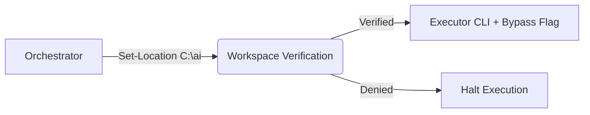

# 🌟 Agent Orchestration Protocol: Executive Summary

## 🔭 The Big Picture: What Is AOP?

Imagine a **symphony orchestra** where each musician is an AI agent with unique specialties. The **Agent Orchestration Protocol (AOP)** is the conductor's methodology—a revolutionary framework that enables one "maestro" AI agent to coordinate multiple "specialist" AI agents, all working together on complex tasks that would overwhelm any single performer.

In simpler terms: **AOP transforms isolated AI assistants into collaborative teams**, unlocking productivity levels previously impossible with solo AI work.

---

## 🧩 The Problem AOP Solves

Traditional AI workflows hit a wall when facing:
- **Multi-Skill Challenges**: Tasks requiring diverse expertise.
- **Parallel Workstreams**: Multiple independent subtasks.
- **Review Loops**: Creator → Reviewer → Finalizer workflows.

**AOP's Solution**: Enable true AI-to-AI collaboration through structured orchestration.

---

## 🏛️ The Seven Pillars of AOP: A Simple Framework

Think of these as the **"ground rules"** that make AI teamwork seamless:

<b>🔍 Expand to view the Seven Pillars</b>

### 1️⃣ Pillar 1: Environment Isolation
**Analogy**: Each agent gets a clean, private workspace.
**Benefit**: Predictable, reproducible results every time.

### 2️⃣ Pillar 2: Absolute Referencing
**Analogy**: Using GPS coordinates instead of "turn left at the red barn."
**Benefit**: Zero ambiguity—agents always find the right files.

### 3️⃣ Pillar 3: Permission Bypass (Trusted Zones Only)
**Analogy**: VIP backstage passes for trusted team members in secure areas.
**Benefit**: Fully automated workflows with enterprise-grade safety.

### 4️⃣ Pillar 4: Active Vigilance (Polling)
**Analogy**: A stage manager checking every 60 seconds: "Is the prop ready yet?"
**Benefit**: Real-time progress tracking and timeout protection.

### 5️⃣ Pillar 5: Integrity Verification
**Analogy**: Quality control inspectors checking every product off the assembly line.
**Benefit**: Confidence that outputs meet quality standards.

### 6️⃣ Pillar 6: Closeout Protocol
**Analogy**: A clear, standardized end-of-task report.
**Benefit**: Every task ends with machine-readable, actionable intelligence.

### 7️⃣ Pillar 7: Constraint Adaptation
**Analogy**: A manager realizing they can't see inside a secure room, so they send a trusted employee with clearance to check.
**Benefit**: Overcomes environmental limitations through intelligent delegation.

---

## 🔒 Enterprise-Grade Security & Routing

AOP includes built-in safeguards to ensure safe execution:

- ✅ **Flexible Security Routing:** Orchestrators dynamically route executors to trusted directories (e.g., `C:\ai`) using `Set-Location`, verifying paths before handover.
- ✅ **Permission Bypass:** Strict rules for `--dangerously-bypass-approvals-and-sandbox` ensure it is only used in authorized zones.

<b>📊 AOP Execution Architecture</b>

---

## 🚀 The Vision: Why AOP Matters for the Future

AOP transforms AI from **solo contributors** into **collaborative teams**, mirroring how human organizations scale complex work. Instead of one generalist AI struggling with everything, AOP deploys **the right expert for each subtask**.

**The question is: Will you be among the first to harness it?**

---

**Version**: 1.3.0
**Created**: 2026-02-24
**Maintained by**: Claude Intelligence Hub Team