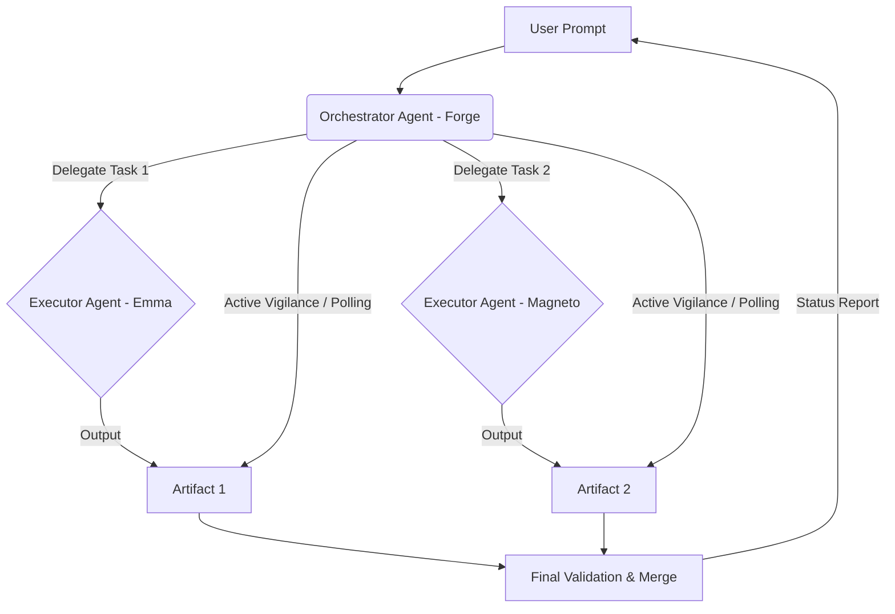

# 🚀 Agent Orchestration Protocol (AOP) - Complete Guide

Welcome to the **Agent Orchestration Protocol (AOP)**, a revolutionary framework for multi-agent coordination in the Claude ecosystem. This guide will take you from zero to orchestration mastery.

---

## 📑 Table of Contents

1. [What is AOP?](#what-is-aop)
2. [Quick Start](#quick-start)
3. [The Seven Pillars Explained](#the-seven-pillars-explained)
4. [Step-by-Step Tutorial](#step-by-step-tutorial)
5. [Fallback & Recovery](#fallback--recovery)
6. [Best Practices](#best-practices)
7. [Troubleshooting](#troubleshooting)
8. [Advanced Patterns](#advanced-patterns)

---

## 🧠 What is AOP?

The **Agent Orchestration Protocol** is a methodology and set of practices that enables a **single Orchestrator Agent** to coordinate **multiple Executor Agents** working on complex, multi-step tasks.

<details>
<summary><b>📊 Click to view the AOP Flow Architecture</b></summary>



</details>

### Key Concepts

- 🎩 **Orchestrator Agent:** The "conductor" - typically Forge - who delegates and monitors tasks.
- 🛠️ **Executor Agent:** The "specialist" - Codex (Emma), Claude Code (Magneto), or any CLI-invocable agent.
- 🤖 **Headless Mode:** Running agents in non-interactive terminal sessions for automation.
- 🛡️ **Trusted Workspace:** Pre-approved directories where permission bypass is allowed.

---

## ⚡ Quick Start

### Your First Orchestration (5 Minutes)

**Objective:** Have Forge orchestrate Emma (Codex) to create a test file.

<details>
<summary><b>💻 View Prompt Example</b></summary>

```prompt
Forge, execute this basic test:
1. Open a PowerShell terminal: powershell -NoProfile -Command
2. Change directory: Set-Location C:\Workspaces\llms_projects
3. Launch Codex CLI using the bypass flag: codex exec --dangerously-bypass-approvals-and-sandbox
4. Ask Codex to create a file named hello_aop.md with content "AOP Test Successful"
5. Verify the file exists
6. Report: SUCCESS or FAIL
```

</details>

---

## 🏛️ The Seven Pillars Explained

### 1️⃣ Pillar 1: Environment Isolation
Ensure Executor Agents operate in clean, predictable environments.
*Implementation:* Spawning agents in dedicated terminal processes.

### 2️⃣ Pillar 2: Absolute Referencing
Eliminate path ambiguity.
*Implementation:* Always use full absolute paths (`C:\Workspaces\llms_projects\document.md`).

### 3️⃣ Pillar 3: Permission Bypass (Trusted Workspaces Only)
Enable fully automated workflows in pre-approved safe directories.
⚠️ **CRITICAL SECURITY NOTE:** Only use in explicitly trusted workspaces.

### 4️⃣ Pillar 4: Active Vigilance (Polling)
Monitor progress and detect task completion.
*Implementation:* Orchestrator polls the file system or git history.

### 5️⃣ Pillar 5: Integrity Verification
Ensure generated artifacts meet quality standards (Existence, Non-Empty, Content).

### 6️⃣ Pillar 6: Closeout Protocol
Provide clear, actionable status reports (`SUCCESS` or `FAIL`).

### 7️⃣ Pillar 7: Constraint Adaptation
Overcome sandbox or environment limitations.
*Implementation:* If an Orchestrator cannot access a resource directly, it MUST delegate the verification task to a new, properly-scoped agent.

---

## 🔒 Execution & Routing Standard (MANDATORY)

To ensure reliable execution, orchestrators must adhere to the **Flexible Security Routing** standard. 

**Rule:** Orchestrators can route executors to ANY trusted, pre-configured project directory (e.g., `C:\ai`, `C:\Workspaces`) using the `Set-Location` syntax, **provided the path is explicitly verified before handover.**

<details>
<summary><b>🛠️ View Execution Options for Codex & Gemini</b></summary>

**For Codex (Emma):**
**Option A (Simple, reliable execution):**
```powershell
Set-Location <Target_Path>
codex exec --dangerously-bypass-approvals-and-sandbox '<Complex_Instructions_Wrapped_In_Single_Quotes>'
```

**Option B (One-liner - Highly Recommended for automated orchestration):**
```powershell
Set-Location <Target_Path>; codex exec --dangerously-bypass-approvals-and-sandbox '<Complex_Instructions_Wrapped_In_Single_Quotes>'
```

**For Gemini (Forge):**
**Option B (One-liner):**
```powershell
Set-Location <Target_Path>; gemini --approval-mode yolo -p "<Complex_Instructions_Wrapped_In_Double_Quotes>"
```

**Option C (Spawn in a completely new terminal instance):**
```powershell
Start-Process powershell -WorkingDirectory <Target_Path>
```

</details>

---

## 🚑 Fallback & Recovery

### Standardized `error.json` Reporting
When an Executor Agent fails, it should generate an `error.json` file in its workspace for the Orchestrator to parse.

<details>
<summary><b>📄 View error.json schema</b></summary>

```json
{
  "failed_step": "Step 3: Writing to file '...'",
  "reason": "Permission denied",
  "details": "The agent did not have write access to the specified directory.",
  "executor_agent_id": "Forge B" 
}
```

</details>

### Polling Best Practices
💡 **Boolean Polling Strategy:** When polling a sub-agent, use boolean prompts like `"Return ONLY 'YES' or 'NO'"` to avoid conversational drift. 

💡 **Delegate the Loop:** Do not spawn a new agent for every check; delegate the entire polling loop to a single, long-lived sub-agent.

---

## 🤝 Support and Contribution

For issues, questions, or contributions to the AOP framework:
- Review the [Security Boundaries](./SKILL.md#security-boundaries) before implementation.
- Check existing worked examples before creating new patterns.

**Version:** 1.3.0
**Last Updated:** 2026-02-24
**Maintained by:** Claude Intelligence Hub Team (Forge Lead)