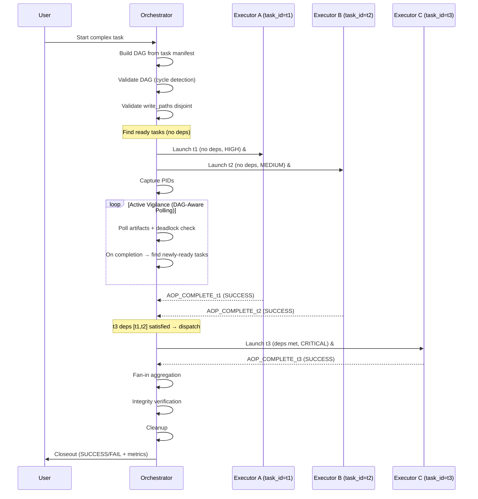

# Agent Orchestration Protocol (AOP)

**Skill ID:** `agent-orchestration-protocol`
**Version:** 4.0.0
**Status:** Production-Validated
**Category:** Multi-Agent Coordination

---

## What AOP Is — and What It Is NOT

AOP = launching real OS processes via shell commands. If you are not executing a shell command that spawns an independent OS process, you are NOT using AOP. AOP supports multi-executor parallel dispatches with dependency DAGs, deadlock detection, and priority-based scheduling.

| Aspect | Internal Sub-agent (NOT AOP) | AOP Headless Session (Real AOP) |
| :--- | :--- | :--- |
| **Process** | Child of parent session | Independent OS process |
| **Context** | Shares parent context | Clean, isolated context |
| **Launch** | Agent tool / internal API call | `claude -p` / `codex exec` / `gemini -p` in shell |
| **Completion** | Synchronous return | Requires polling (Pillar 4) |
| **Pillar 1 compliant** | No | Yes |

**Rule:** If the Orchestrator does not run a shell command (`Bash` tool, terminal, PowerShell), it is NOT AOP. The Agent tool is useful — it is just a different pattern.

---

## Orchestration Flow



---

## The Seven Pillars of AOP

Use this as an actionable checklist. Each pillar has a definition, implementation command, and a verification test.

---

### Pillar 1: Environment Isolation

**Definition:** Executor Agents operate in clean, independent shell environments — separate OS processes with no shared state.

**Implementation:**
```bash
# Launch headless executor as independent OS process
cat AOP_PROMPT_${SESSION_ID}.md | claude -p --dangerously-skip-permissions --model claude-sonnet-4-6 &
EXECUTOR_PID=$!
```

**Verification:** `ps aux | grep claude` (bash) or `Get-Process claude` (PowerShell) — confirms independent process with its own PID.

---

### Pillar 2: Absolute Referencing

**Definition:** All file and directory references use absolute paths. Relative paths cause silent failures when working directories differ between Orchestrator and Executor.

**Implementation:**
```bash
# Always specify full paths in executor prompts
# Good:  /c/ai/claude-intelligence-hub/agent-orchestration-protocol/SKILL.md
# Bad:   ./SKILL.md   or   ../agent-orchestration-protocol/SKILL.md
```

**Verification:** Grep the prompt file for relative paths before launch:
```bash
grep -n '^\./\|^\.\.\/' AOP_PROMPT_${SESSION_ID}.md && echo "WARN: relative paths found"
```

---

### Pillar 3: Permission Bypass (Trusted Workspaces Only)

**Definition:** Automate permission approval only in pre-approved, known-safe directories. The bypass flags skip interactive prompts — they do NOT grant new capabilities or protect against bad instructions.

**Implementation:**
```bash
# Claude Code
claude -p --dangerously-skip-permissions --model claude-sonnet-4-6

# Codex
codex exec --dangerously-bypass-approvals-and-sandbox 'instructions'

# Gemini
gemini --approval-mode yolo -p "instructions"
```

**Verification:** Confirm workspace path is in the trusted allow-list before launch (see Security Boundaries section).

---

### Pillar 4: Active Vigilance (Polling)

**Definition:** The Orchestrator monitors task completion by polling for a completion artifact. It never waits synchronously.

**Implementation:**
```bash
# Adaptive polling: 30s for first 2 min, then 60s
POLLS=0; MAX_POLLS=20
while [ $POLLS -lt $MAX_POLLS ]; do
  test -f AOP_COMPLETE_${SESSION_ID}.json && test -s AOP_COMPLETE_${SESSION_ID}.json && break
  POLLS=$((POLLS+1))
  [ $POLLS -le 4 ] && sleep 30 || sleep 60
done
```

**Verification:** Confirm `status` field in the artifact is `SUCCESS` before proceeding.

**Scaling note:**
- For single-executor: standard polling above is sufficient.
- For multi-executor (3+ executors): use the Multi-Executor Polling Loop or Event-Driven Detection (see Polling & Completion section). Classic 30-60s intervals become impractical when monitoring N artifacts concurrently.

---

### Pillar 5: Integrity Verification

**Definition:** The Orchestrator independently verifies the Executor's work — not by trusting the completion artifact alone, but by checking actual outputs.

**Implementation:**
```bash
# Check expected files exist and are non-empty
test -s /c/ai/target-project/output.md && echo "OK" || echo "FAIL"

# Run test suite if applicable
cd /c/ai/target-project && python -m pytest tests/ -q
```

**Verification:** Every verification step must produce explicit PASS/FAIL output. Do not assume.

---

### Pillar 6: Closeout Protocol

**Definition:** The Orchestrator always returns a final status report to the user — either `SUCCESS` or `FAIL` — with concrete evidence.

**Implementation:**
```
STATUS: SUCCESS
- Executor: Claude Sonnet 4.6 (headless AOP)
- Files changed: 3 (agent.py, tests/test_agent.py, CHANGELOG.md)
- Tests: 372/372 PASS
- Duration: ~9 min (84 tool calls)
- Artifact: AOP_COMPLETE_a1b2.json (verified)
```

**Verification:** No closeout without evidence. If you cannot point to a verification result, the status is FAIL.

---

### Pillar 7: Constraint Adaptation

**Definition:** If the Orchestrator cannot directly access a resource (sandbox restriction, path boundary, tool limitation), it delegates the constrained operation to an appropriately-scoped executor.

**Implementation:**
```bash
# Delegate to a headless agent that CAN access the constrained path
echo "Read /c/ai/protected-dir/result.json and return its content." \
  | claude -p --dangerously-skip-permissions --model claude-sonnet-4-6
```

**Verification:** Confirm the delegated agent's response contains the expected data before proceeding.

---

## Security Boundaries

### Trusted Workspace Definition

A **trusted workspace** is a directory explicitly pre-approved for bypass execution. The current allow-list:

```
C:\ai\                          # Primary AI workspace
C:\ai\_worktrees\               # Git worktrees
C:\Workspaces\llms_projects\    # Legacy project directory
C:\ai\temp\                     # Ephemeral work
```

**Before any bypass execution, verify the path is in this list:**
```bash
TARGET="/c/ai/my-project"
echo "$TARGET" | grep -qE '^/c/ai/|^/c/Workspaces/llms_projects' \
  && echo "TRUSTED" || echo "NOT TRUSTED - abort"
```

### What Bypass Flags Do and Do NOT Do

| Bypass flag | What it does | What it does NOT do |
| :--- | :--- | :--- |
| `--dangerously-skip-permissions` | Skips interactive Y/N prompts | Does not expand what the agent can access |
| `--dangerously-bypass-approvals-and-sandbox` | Disables sandboxing and approval gates | Does not grant filesystem permissions the shell doesn't already have |
| `--approval-mode yolo` | Auto-approves all Gemini actions | Does not bypass OS-level permissions |

### Mandatory `write_paths` Declaration

Every executor prompt MUST declare what it is allowed to write:

```
WRITE SCOPE (you may ONLY write to these paths):
- /c/ai/my-project/src/
- /c/ai/my-project/tests/
- /c/ai/my-project/AOP_COMPLETE_{session_id}.json

DO NOT write to: /c/ai/other-project/, system directories, or credential stores.
```

### Post-Execution Verification Recommendation

After each executor session, the Orchestrator verifies writes stayed in scope:
```bash
git -C /c/ai/target-project diff --name-only HEAD~1
```
Compare this list to the declared write scope. Any file outside the scope = security incident.

**Full implementation:** See [`scripts/aop-post-audit.sh`](./scripts/aop-post-audit.sh) for per-executor audit with multi-task support.

### DO NOT USE bypass for:
- Production repositories without an explicit PR review step
- System directories (`C:\Windows\`, `/etc/`, `/usr/`)
- Credential stores, `.env` files, or secrets vaults
- Any path not in the trusted workspace allow-list above

---

## Multi-Executor Coordination

Rules for running two or more executors in parallel within the same orchestration session. Skip this section for single-executor workflows.

---

### Pre-Dispatch Write Path Validation

**Definition:** Before launching N executors in parallel, the Orchestrator MUST verify that all declared `write_paths` are disjoint — no two executors may write to the same file or directory subtree.

**Algorithm:**
1. Collect all `write_paths` from every executor's prompt (one array per executor).
2. Check pairwise: does any path in executor A's list share a prefix with any path in executor B's list?
3. If any overlap is found → ABORT. Restructure tasks so each executor owns a distinct subtree.

**Pattern:**
```bash
# Check if two paths overlap (one is prefix of the other)
if [[ "$path_b" == "$path_a"* ]] || [[ "$path_a" == "$path_b"* ]]; then
  echo "CONFLICT: '$path_a' overlaps '$path_b'" >&2
fi
```

**Full implementation:** See [`scripts/aop-write-path-validator.sh`](./scripts/aop-write-path-validator.sh)

**Verification:** Script exits 0 and prints "Write paths validated" before any executor is launched.

---

### Executor Isolation Rules

**Definition:** Each executor in a parallel dispatch is fully isolated — unique identity, unique artifact, no cross-reads during execution.

**Rules:**
- **`executor_id`** format: `exec_{task_id}_{session_id}` — unique per executor, embedded in the completion artifact.
- **Artifact naming:** Each executor writes `AOP_COMPLETE_{task_id}_{session_id}.json` using its own `task_id`. Filenames never collide.
- **No cross-reads:** Executors MUST NOT read each other's artifacts or intermediate outputs during execution. They operate on their declared write scope only.
- **Orchestrator-only aggregation:** Only the Orchestrator reads all artifacts after all executors complete.

**Pattern (launching two parallel executors):**
```bash
SESSION_ID="$(date +%s%N | sha256sum | head -c 8)"

cat AOP_PROMPT_${TASK_A}_${SESSION_ID}.md | claude -p --dangerously-skip-permissions --model claude-sonnet-4-6 &
PID_A=$!

cat AOP_PROMPT_${TASK_B}_${SESSION_ID}.md | claude -p --dangerously-skip-permissions --model claude-sonnet-4-6 &
PID_B=$!
```

**Full implementation:** See [`scripts/aop-session-id.sh`](./scripts/aop-session-id.sh) for collision-safe session ID generation.

**Verification:** `ps aux | grep claude` shows two independent processes; each has its own PID and prompt file.

---

### Post-Execution Write Scope Audit (Multi-Executor)

**Definition:** After all executors complete, the Orchestrator runs a per-executor git diff and compares actual writes against each executor's declared write scope. Any file written outside scope is a security incident.

**Pattern:**
```bash
CHANGED=$(git -C /c/ai/project diff --name-only HEAD~1)
echo "$CHANGED" | grep -v "^expected/scope/" && echo "SECURITY INCIDENT"
```

**Full implementation:** See [`scripts/aop-post-audit.sh`](./scripts/aop-post-audit.sh)

**Verification:** Every executor prints "PASS" or triggers the security incident path. No silent audits.

---

## Fan-In/Fan-Out Orchestration

End-to-end protocol for the Orchestrator to dispatch N parallel executors (fan-out), collect all results (fan-in), and maintain recoverable state throughout the workflow.

---

### Fan-Out: Dispatching Parallel Executors

**Definition:** The Orchestrator builds a task manifest, validates write path isolation, generates per-task prompts, launches all executors, and enters the multi-executor polling loop.

**Step-by-step:**
1. Define task manifest — array of `{task_id, prompt_summary, model, write_paths, priority}`.
2. Validate write paths are disjoint (call Pre-Dispatch Write Path Validation from Multi-Executor Coordination).
3. Generate prompt files for each task — file-based, task-id-namespaced.
4. Initialize the Orchestrator State File (see below).
5. Launch all executors in background.
6. Enter Multi-Executor Polling Loop (from Polling & Completion section).

**Task manifest format:**
```bash
# Format: "task_id:model:write_path"
TASKS=(
  "update-readme:claude-sonnet-4-6:${PROJECT_DIR}/README.md"
  "update-changelog:claude-sonnet-4-6:${PROJECT_DIR}/CHANGELOG.md"
  "run-tests:claude-haiku-4-5:${PROJECT_DIR}/test-results/"
)
```

**Full implementation:** See [`scripts/aop-fan-out.sh`](./scripts/aop-fan-out.sh)

---

### Fan-In: Collecting and Aggregating Results

**Definition:** After all executors settle (complete, fail, or time out), the Orchestrator reads every individual `AOP_COMPLETE_{task_id}_{session_id}.json` artifact and produces a single aggregation artifact: `AOP_FANIN_{session_id}.json`.

**Aggregation artifact schema:**
```json
{
  "session_id": "a1b2c3d4",
  "total_tasks": 3,
  "completed": 2,
  "failed": 1,
  "timed_out": 0,
  "overall_status": "PARTIAL_SUCCESS",
  "tasks": [
    {
      "task_id": "update-readme",
      "status": "SUCCESS",
      "artifact": "AOP_COMPLETE_update-readme_a1b2c3d4.json",
      "duration_s": 120,
      "files_changed": ["README.md"]
    }
  ],
  "aggregated_files_changed": ["README.md", "CHANGELOG.md"],
  "fan_in_timestamp": "2026-03-18T14:45:00Z"
}
```

**Status determination:**

| Condition | `overall_status` |
| :--- | :--- |
| All tasks SUCCESS | `SUCCESS` |
| All tasks FAILURE or TIMEOUT | `FAILURE` |
| Mixed results | `PARTIAL_SUCCESS` |

**Full implementation:** See [`scripts/aop-fan-in.sh`](./scripts/aop-fan-in.sh)

**Partial success handling:** When some executors succeed and others fail or time out, the Orchestrator:
1. Reports `PARTIAL_SUCCESS` with per-task details.
2. Includes `error` field for each failed/timed-out task.
3. Aggregates `files_changed` only from successful executors.
4. Presents the report to the user before deciding whether to retry failed tasks or abort.

---

### Orchestrator State File

**Definition:** The Orchestrator maintains a state file (`AOP_STATE_{session_id}.json`) throughout any multi-executor workflow. This file is updated after each event (launch, completion, timeout, failure) and enables crash recovery if the Orchestrator process dies.

**Schema:**
```json
{
  "session_id": "a1b2c3d4",
  "workflow_type": "PARALLEL",
  "started_at": "2026-03-18T14:30:00Z",
  "last_updated": "2026-03-18T14:35:12Z",
  "executors": [
    {
      "task_id": "update-readme",
      "pid": 12345,
      "status": "RUNNING",
      "model": "claude-sonnet-4-6",
      "launched_at": "2026-03-18T14:30:01Z",
      "completed_at": null,
      "artifact_path": "/c/ai/target-project/AOP_COMPLETE_update-readme_a1b2c3d4.json"
    }
  ]
}
```

**Atomic update pattern:**
```bash
# Write to temp, then mv — never write in-place
tmp="${STATE_FILE}.tmp.$$"
printf '%s\n' "$content" > "$tmp"
mv -f "$tmp" "$STATE_FILE"
```

**Full implementation:** See [`scripts/aop-state-manager.sh`](./scripts/aop-state-manager.sh)

**Rules:**
- The state file is written atomically via temp + `mv` — never written in-place.
- Updated on every event: executor launch, completion detection, timeout, failure.
- Deleted during cleanup only after the fan-in artifact has been successfully written.

---

### Crash Recovery Protocol

**Definition:** If the Orchestrator process crashes or is restarted mid-workflow, it reads the state file to reconstruct what happened and resumes monitoring any still-running executors.

**Steps:**
1. Scan for `AOP_STATE_*.json` files in the project directory.
2. For each state file, parse executor entries.
3. Check which executors are still running (`kill -0 $PID`).
4. Check for completion artifacts from executors that finished while the Orchestrator was down.
5. Resume the polling loop for any still-running executors.
6. Report recovered state to the user before continuing.

**Full implementation:** See [`scripts/aop-crash-recovery.sh`](./scripts/aop-crash-recovery.sh)

**Rules:**
- Crash recovery is the FIRST thing the Orchestrator does on startup if state files exist.
- The Orchestrator reports recovered state to the user before resuming or proceeding to fan-in.
- Dead executors with no artifact are marked `FAILURE` — the Orchestrator does not auto-retry. Retry decisions are left to the user.
- After recovery and fan-in, state files are cleaned up along with other artifacts.

---

## Task Dependency Management

Protocol for declaring task dependencies as a DAG (Directed Acyclic Graph), detecting deadlocks, and prioritizing task execution. Builds on the Fan-In/Fan-Out and Multi-Executor Coordination sections.

---

### Task Dependency Declaration

The Orchestrator declares dependencies using a DAG. Each task has a `depends_on` field listing task IDs it must wait for. Tasks with no dependencies are dispatched immediately in parallel. Tasks with dependencies wait until ALL dependencies are COMPLETE.

**Task manifest format with dependencies:**
```json
{
  "tasks": [
    {"task_id": "t1", "prompt": "...", "model": "sonnet", "depends_on": []},
    {"task_id": "t2", "prompt": "...", "model": "sonnet", "depends_on": []},
    {"task_id": "t3", "prompt": "...", "model": "opus", "depends_on": ["t1", "t2"]},
    {"task_id": "t4", "prompt": "...", "model": "sonnet", "depends_on": ["t3"]}
  ]
}
```

In this example: t1 and t2 run in parallel. When both complete, t3 runs. When t3 completes, t4 runs.

**Extended manifest with priority and weight:**
```json
{
  "tasks": [
    {"task_id": "t1", "prompt": "...", "model": "sonnet", "depends_on": [], "priority": "HIGH", "weight": 3},
    {"task_id": "t2", "prompt": "...", "model": "haiku", "depends_on": [], "priority": "MEDIUM", "weight": 1},
    {"task_id": "t3", "prompt": "...", "model": "opus", "depends_on": ["t1", "t2"], "priority": "CRITICAL", "weight": 5}
  ]
}
```

**Backwards compatibility:** Tasks without `depends_on` are treated as having no dependencies (same as `[]`). Tasks without `priority` default to `MEDIUM`. Tasks without `weight` default to `3`.

---

### DAG Execution Engine

The DAG engine manages execution order based on the dependency graph:

**Algorithm:**
1. Build adjacency list from task manifest.
2. Validate the graph is a valid DAG (no cycles) — see DAG Cycle Detection.
3. Identify ready tasks (tasks with no pending dependencies).
4. Sort ready tasks by priority, then by weight descending.
5. Dispatch ready tasks up to MAX_CONCURRENT (fan-out).
6. As each task completes, update state and find newly-ready tasks.
7. Dispatch newly-ready tasks (respecting MAX_CONCURRENT).
8. Repeat until all tasks complete or a task fails.
9. If a task fails, propagate failure to all transitive dependents (see Dependency Failure Propagation).

**Core loop pattern:**
```bash
while ! dag_all_settled; do
  ready_list=$(find_ready_tasks)      # sorted by priority, weight
  dispatch up to MAX_CONCURRENT       # launch executors
  poll running executors              # check artifacts
  on_complete → find newly-ready      # cascade dispatch
  on_failure → propagate_failure      # skip dependents
  sleep $POLL_INTERVAL
done
```

**Full implementation:** See [`scripts/aop-dag-engine.sh`](./scripts/aop-dag-engine.sh)

**Edge cases handled:**
- **Single task:** No dependencies, dispatched immediately.
- **All parallel:** All tasks have `depends_on: []`, dispatched up to MAX_CONCURRENT.
- **Fully sequential:** Each task depends on the previous, forming a chain.
- **Diamond dependencies:** t3 depends on both t1 and t2 — waits for both. t4 also depends on t1 and t2 independently.

---

### DAG Cycle Detection

Before execution, validate the dependency graph has no cycles. A cycle makes execution impossible (tasks waiting for each other forever).

**Algorithm:** DFS-based cycle detection using three-color marking:
- WHITE (unvisited), GRAY (in current DFS path), BLACK (fully processed).
- If DFS visits a GRAY node, a cycle exists.

**Full implementation:** See [`scripts/aop-dag-validator.sh`](./scripts/aop-dag-validator.sh)

**Example cycle error output:**
```
ERROR: Cycle detected in dependency graph!
Cycle: t1 -> t3 -> t2 -> t1
```

If a cycle is detected, the Orchestrator MUST abort before dispatching any executors.

---

### Dependency Failure Propagation

If a task FAILS, all tasks that depend on it — directly or transitively — are marked SKIPPED. The Orchestrator still executes tasks that don't depend on the failed task.

**Algorithm:**
1. When task X fails, find all tasks where X appears in `depends_on` (direct dependents).
2. Mark each direct dependent as SKIPPED.
3. Recursively propagate: for each newly-SKIPPED task, find its dependents and mark them SKIPPED too.
4. Tasks with no dependency on X continue executing normally.

**Example propagation:**
```
t1 (FAILED) → t3 (SKIPPED, depends on t1) → t5 (SKIPPED, depends on t3)
t2 (COMPLETE) → t4 still runs (depends only on t2, not on t1)
```

**End-of-execution report includes propagation details:**
```
=== DAG Execution Report ===
  t1: FAILED (timeout)
  t2: COMPLETE
  t3: SKIPPED (dependency t1 FAILED)
  t4: COMPLETE
  t5: SKIPPED (dependency t3 SKIPPED)
Tasks executed: 3/5 | Succeeded: 2 | Failed: 1 | Skipped: 2
```

**Full implementation:** Integrated into [`scripts/aop-dag-engine.sh`](./scripts/aop-dag-engine.sh) (see `propagate_failure()` function).

---

### Deadlock Detection

In complex DAG workflows, deadlocks can occur when:
1. **Circular dependency** — caught by DAG Cycle Detection before execution starts.
2. **All executors blocked** — all running executors are waiting for resources held by others.
3. **Executor hang** — an executor produces no artifact and doesn't time out (e.g., stuck in an infinite loop with occasional output that resets process-level timeouts).

**Detection mechanism — integrated with the multi-executor polling loop:**

The Orchestrator tracks "progress" across consecutive poll cycles. Progress means at least one executor completed, failed, or timed out. If no progress occurs for multiple consecutive cycles, deadlock escalation begins.

**Escalation protocol:**

| Stage | Condition | Action |
| :--- | :--- | :--- |
| NORMAL | At least 1 executor progressed in this cycle | Reset stall counter |
| WARN | 2 consecutive cycles with no progress | Log warning, check if all executors exceeded 50% of their timeout |
| ESCALATE | 3 consecutive cycles with no progress AND all running executors >50% timeout | Log escalation, report to user |
| DEADLOCK | 4 consecutive cycles with no progress | Declare DEADLOCK, kill all running executors, report to user |

**Full implementation:** See [`scripts/aop-deadlock-detector.sh`](./scripts/aop-deadlock-detector.sh)

**Integration with the DAG polling loop:**
```bash
source scripts/aop-deadlock-detector.sh
# At the end of each poll cycle:
check_deadlock "$progress"
[ $? -eq 2 ] && echo "DEADLOCK: Aborting" && break
```

**False positive prevention:**
- The threshold requires **4 consecutive stall cycles** (12 seconds at 3s polling). Normal slow execution where an executor takes a long time but eventually completes will reset the counter.
- Individual per-executor timeouts handle the case where one executor hangs — it will time out and be killed independently, which counts as "progress" and resets the stall counter.
- Deadlock detection fires only when ALL executors are simultaneously stuck, which is distinct from slow execution.

---

### Task Priority & Weight System

Each task in the manifest can declare a priority level and a numeric weight that influence dispatch order, model selection, and timeout behavior.

**Priority levels (highest to lowest):**

| Priority | Rank | Default model tier | Timeout multiplier | Description |
| :--- | :--- | :--- | :--- | :--- |
| CRITICAL | 0 | Tier 1 (Opus) | 2x | Must succeed, longest timeout |
| HIGH | 1 | Tier 1 or 2 | 1x | Important, normal timeout |
| MEDIUM | 2 | Tier 2 (Sonnet) | 1x | Default — most tasks |
| LOW | 3 | Tier 2 or 3 | 0.5x | Can wait, shorter timeout |

**Weight:** Numeric value 1-5 representing relative importance/complexity. When two tasks have the same priority, higher weight is dispatched first. Default: 3.

**Effects of priority:**
1. **Dispatch order:** When the DAG engine has multiple ready tasks, they are sorted by priority rank (ascending), then weight (descending). CRITICAL tasks launch first.
2. **Resource allocation:** When MAX_CONCURRENT is reached, higher-priority tasks are queued ahead of lower-priority tasks.
3. **Timeout adjustment:** CRITICAL tasks get 2x the base MAX_POLLS. LOW tasks get 0.5x.
4. **Model suggestion:** CRITICAL tasks default to Tier 1 models. LOW tasks default to Tier 2/3. These are suggestions — the manifest's explicit `model` field always takes precedence.

**Full implementation:** See [`scripts/aop-priority-queue.sh`](./scripts/aop-priority-queue.sh)

---

### Maximum Concurrent Executors

Configurable upper bound on parallel executor count. Prevents resource exhaustion when a DAG has many independent tasks.

**Parameter:** `MAX_CONCURRENT` (default: 4)

**Behavior:**
- When more tasks are ready than MAX_CONCURRENT allows, excess tasks are queued.
- The queue is ordered by priority (CRITICAL first) then weight (descending).
- As running executors complete, the next ready task is dequeued and launched.

**Example with MAX_CONCURRENT=2:**
```
Cycle 1: t1 (HIGH) and t3 (CRITICAL) ready → dispatch t3, t1 (sorted by priority)
         t2 (MEDIUM) ready but slots full → queued
Cycle N: t3 completes → slot opens → dispatch t2
```

**Tuning guidance:**
- `MAX_CONCURRENT=2` — constrained environments (low memory/CPU).
- `MAX_CONCURRENT=4` — typical development machines (default).
- `MAX_CONCURRENT=8` — powerful machines or cloud instances with many cores.
- Set based on available system resources, not task count.

**Full implementation:** See [`scripts/aop-priority-queue.sh`](./scripts/aop-priority-queue.sh) (includes `dispatch_ready_tasks()` and `count_running()`).

---

## Model Selection for Headless Dispatches

**MANDATORY:** Before dispatching any headless session, the Orchestrator MUST select the appropriate model based on task complexity. Do NOT default to the most expensive model for every task.

**Quick rule:** Does this task need a brain, or just hands?
- **Hands** (mechanical, template, notification) → Tier 3: Haiku / GPT-5.1-codex-mini / Flash-Lite
- **Brain** (implementation, coding, structured writing) → Tier 2: Sonnet / GPT-5.4-mini / Flash
- **Big brain** (synthesis, audit, architecture, 5+ doc cross-reference) → Tier 1: Opus / GPT-5.4 high / Pro

| Tier | Anthropic | OpenAI | Google | Use When |
|---|---|---|---|---|
| 1 (Architect) | `claude-opus-4-6` | `gpt-5.4` (high/xhigh) | `gemini-3.1-pro` | Complex reasoning, multi-doc synthesis, audits |
| 2 (Engineer) | `claude-sonnet-4-6` | `gpt-5.4-mini` / `gpt-5.3-codex` | `gemini-3-flash` | Implementation, coding, daily work (80% of tasks) |
| 3 (Operator) | `claude-haiku-4-5` | `gpt-5.1-codex-mini` / `gpt-5.4-nano` | `gemini-3.1-flash-lite` | Mechanical tasks, templates, bulk ops |

**Full guide with 25+ task examples, mixed-model patterns, cost analysis, and provider-specific CLI syntax:**
See `06-operationalization/llm-model-selection-guide-for-aop-orchestrators-magneto-2026-03-18-v2.0.md` in the AOP project documentation.

**AOP Integration Rules:**
1. State in the session doc which model was selected and WHY
2. For parallel dispatches, assign models per-task, not one model for all
3. If a task fails on a lower-tier model, escalate to next tier before retrying
4. Never use Tier 1 for tasks classified as Trivial or Low in the decision matrix

---

## Execution Standard

### Primary Pattern: File-Based Prompt (Recommended)

Write the executor prompt to a file and pipe it. This avoids all escaping issues with code snippets, tables, JSON, and special characters.

```bash
# Collision-safe session ID + file-based prompt
SESSION_ID="$(date +%s%N | sha256sum | head -c 8)"
TASK_ID="round-1-rewrite"
PROMPT_FILE="AOP_PROMPT_${TASK_ID}_${SESSION_ID}.md"

cat > "${PROMPT_FILE}" << 'PROMPT_EOF'
You are an Executor Agent. Your working directory: /c/ai/target-project
WRITE SCOPE: /c/ai/target-project/src/
TASK: [detailed task instructions here]
PROMPT_EOF

cd /c/ai/target-project
cat "${PROMPT_FILE}" | claude -p --dangerously-skip-permissions --model claude-sonnet-4-6 &
EXECUTOR_PID=$!
```

**PowerShell alternative:**
```powershell
Set-Location C:\ai\target-project
Get-Content "AOP_PROMPT_${SESSION_ID}.md" | claude -p --dangerously-skip-permissions --model claude-sonnet-4-6
```

### Inline Prompt Pattern (Simple tasks only)

Use only when the instruction has no special characters, code blocks, or JSON:
```bash
cd /c/ai/target-project
claude -p "Create a file called hello.md with content 'AOP test'." \
  --dangerously-skip-permissions --model claude-sonnet-4-6 &
EXECUTOR_PID=$!
```

### Cleanup Protocol

After a successful execution:
```bash
rm -f "${PROMPT_FILE}"      # Delete prompt file
rm -f "${ARTIFACT}"         # Delete completion artifact
echo "Cleanup complete."
```

### Artifact Naming Convention

Use both task_id and session_id for multi-executor-safe naming:
```
AOP_PROMPT_{task_id}_{session_id}.md      # Prompt file
AOP_COMPLETE_{task_id}_{session_id}.json  # Completion artifact
error_{task_id}_{session_id}.json         # Error artifact (if failed)
```

Each executor in a parallel dispatch gets a unique `task_id`, so artifacts never collide even when multiple executors write simultaneously.

**Backward compatibility:** Single-executor workflows MAY omit `task_id` (falls back to v3.0 naming: `AOP_COMPLETE_{session_id}.json`). Multi-executor workflows MUST use the full `{task_id}_{session_id}` convention.

---

## Polling & Completion

All polling uses artifact-based detection. Do not parse stdout.

### Standard Polling Loop

```bash
POLLS=0; MAX_POLLS=20; ARTIFACT="AOP_COMPLETE_${SESSION_ID}.json"

while [ $POLLS -lt $MAX_POLLS ]; do
  test -f "${ARTIFACT}" && test -s "${ARTIFACT}" && { cat "${ARTIFACT}"; break; }
  POLLS=$((POLLS + 1))
  [ $POLLS -le 4 ] && sleep 30 || sleep 60   # Adaptive: 30s then 60s
done

[ $POLLS -ge $MAX_POLLS ] && echo "TIMEOUT" && kill "${EXECUTOR_PID}" 2>/dev/null
```

### Multi-Executor Polling Loop

When N executors run in parallel, the Orchestrator checks all artifacts each cycle — reporting completions as they arrive rather than waiting for the last one.

**Pattern:**
```bash
# Initialize per-executor tracking
declare -A EXECUTOR_STATUS EXECUTOR_POLLS EXECUTOR_PID_MAP
# ... populate from launch ...

# Fast-interval sweep (3s recommended for multi-executor)
while ! all_done; do
  for tid in "${TASK_IDS[@]}"; do
    # Check artifact, update status, handle timeout
    test -f "AOP_COMPLETE_${tid}_${SESSION_ID}.json" && EXECUTOR_STATUS[$tid]="COMPLETE"
  done
  sleep 3
done
```

**Full implementation:** See [`scripts/aop-multi-poll.sh`](./scripts/aop-multi-poll.sh)

**Verification:** After the loop, every entry in `EXECUTOR_STATUS` must be `COMPLETE` or `TIMEOUT`. A `PENDING` entry means the loop exited prematurely — do not proceed.

---

### Per-Executor Timeout

Each executor has its own poll counter. When one times out, only that executor is killed — the others continue.

**Pattern:**
```bash
# Kill only the timed-out executor
kill "${EXECUTOR_PID_MAP[$tid]}" 2>/dev/null
sleep 1
kill -9 "${EXECUTOR_PID_MAP[$tid]}" 2>/dev/null
```

**Verification:** After a per-executor timeout, confirm with `ps aux | grep claude` that other executor PIDs are still running.

---

### Event-Driven Detection (Recommended for Multi-Executor)

Classic 30-60s polling is acceptable for a single executor but creates 30-90s detection lag when monitoring N executors. Use fast-polling or a file watcher to reduce this to <3s.

#### Fast-Polling Pattern (Minimum Viable for Multi-Executor)

Replace the adaptive 30/60s interval with a fixed 3s interval. This is the simplest upgrade and achieves <3s detection with minimal overhead.

**Full implementation:** See [`scripts/aop-fast-poll.sh`](./scripts/aop-fast-poll.sh)

When to use:
- Any multi-executor dispatch (2+ executors).
- Tasks expected to complete in under 5 minutes.
- Environments where Python/Node.js are unavailable.

#### File Watcher Pattern (Optional — Maximum Performance)

A file watcher monitors the artifact directory for `AOP_COMPLETE_*.json` creation events. Detection latency: **<1 second**. The watcher writes a signal file; the Orchestrator reads it.

**Implementations:**
- **Python (watchdog):** See [`scripts/aop-file-watcher.py`](./scripts/aop-file-watcher.py)
- **Node.js (chokidar):** See [`scripts/aop-file-watcher.js`](./scripts/aop-file-watcher.js)

**Orchestrator reads signal files instead of polling individual artifacts:**
```bash
SIGNAL="SIGNAL_AOP_COMPLETE_${tid}_${SESSION_ID}.txt"
if test -f "${SIGNAL_DIR}/${SIGNAL}"; then
  ARTIFACT_PATH=$(cat "${SIGNAL_DIR}/${SIGNAL}")
  EXECUTOR_STATUS[$tid]="COMPLETE"
fi
```

**Installation:**
```bash
pip install watchdog          # Python
npm install chokidar          # Node.js
```

**Comparison:**

| Pattern | Detection latency | Setup | Overhead |
| :--- | :--- | :--- | :--- |
| Standard polling (30-60s) | 30-90s | None | Minimal |
| Fast-polling (3s) | <3s | None | Low |
| File watcher (watchdog/chokidar) | <1s | pip/npm install | Low (event-driven) |

**Rule:** File watcher is OPTIONAL — fast-polling alone achieves <3s detection for most workloads. Use the watcher only when sub-second latency is required (e.g., tight SLAs, 10+ executor dispatches).

---

### Key Rules

- **Non-empty check is mandatory:** `test -f FILE && test -s FILE` — a 0-byte file means the executor crashed mid-write.
- **Maximum 20 polls (single-executor) / 60 polls (multi-executor at 3s):** Never poll indefinitely. After MAX_POLLS, kill the executor and escalate.
- **Adaptive intervals (single-executor):** 30s for the first 2 minutes (4 polls), then 60s. Balances responsiveness and CPU.
- **PID capture at launch:** Always capture `$!` immediately after the `&` launch. You need it for the timeout kill.
- **When polling N executors, check all artifacts each cycle** — one sweep per interval, not one sleep per executor.
- **Never kill all executors because one timed out** — per-executor timeouts are independent. Log the timeout and continue monitoring the rest.
- **Report intermediate completions to the user** — don't wait for the final fan-in to communicate progress.

---

## Error Recovery

### Timeout Recovery

```bash
# 1. Kill the executor
kill "${EXECUTOR_PID}" 2>/dev/null
sleep 2
kill -9 "${EXECUTOR_PID}" 2>/dev/null

# 2. Check for partial results
git -C /c/ai/target-project diff --name-only HEAD

# 3. Decide: retry with narrower scope, or abort and report FAIL
```

### Executor Crash Recovery

```bash
# 1. Check for error artifact
test -f "error_${SESSION_ID}.json" && cat "error_${SESSION_ID}.json"

# 2. Check git state
git -C /c/ai/target-project status
git -C /c/ai/target-project log --oneline -3

# 3. Decide: retry (idempotent tasks only) or abort
```

### Orchestrator Crash: Detecting Orphaned Processes

```bash
# Find any running headless claude sessions
ps aux | grep 'claude -p' | grep -v grep

# Kill orphaned processes by PID
kill $ORPHAN_PID
```

**Full crash recovery with state reconstruction:** See [`scripts/aop-crash-recovery.sh`](./scripts/aop-crash-recovery.sh)

### Rollback Protocol

| Scenario | Rollback method |
| :--- | :--- |
| Executor wrote bad content but committed | `git revert HEAD` in target project |
| Executor wrote bad content, not committed | `git checkout -- .` in target project |
| Executor wrote to files outside scope | Restore from `git stash` if snapshot was taken; otherwise `git checkout <sha> -- file` |
| Files outside git | Orchestrator takes file copy snapshot before launch: `cp target.md target.md.bak` |

**Snapshot rule:** For any file outside git tracking, the Orchestrator MUST copy it before launching the executor:
```bash
cp /c/ai/config/settings.json /c/ai/config/settings.json.bak_${SESSION_ID}
```

---

## Governance (Lightweight)

### Audit Trail

The Orchestrator logs key events to a JSONL file — one JSON object per line, append-only:

```bash
AUDIT_LOG="/c/ai/aop-audit.jsonl"
log_event() {
  echo "{\"timestamp\":\"$(date -u +%Y-%m-%dT%H:%M:%SZ)\",\"task_id\":\"$1\",\"executor\":\"$2\",\"status\":\"$3\",\"files_changed\":$4}" >> "${AUDIT_LOG}"
}
```

**Minimum required fields:**

| Field | Type | Description |
| :--- | :--- | :--- |
| `timestamp` | ISO 8601 | Event time (UTC) |
| `task_id` | string | Human-readable task identifier |
| `executor` | string | Model + mode (e.g., `claude-sonnet-4-6 headless`) |
| `status` | `SUCCESS` or `FAIL` | Final outcome |
| `files_changed` | array | List of file paths written by executor |

**Optional fields:** `findings_count`, `cost_tracking`, `error_details`, `polls_to_detection`, `duration_seconds`

### Default Guard Rails

Apply these defaults to every orchestration unless explicitly overridden:

| Guard rail | Default |
| :--- | :--- |
| Poll timeout | 20 polls max (~14 min) |
| Kill on timeout | Yes — `kill $EXECUTOR_PID` |
| Require completion artifact | Yes — `SUCCESS` status required |
| Write scope declaration | Mandatory in every executor prompt |
| Post-execution git diff check | Recommended |

### Cost Tracking

Executors self-report in the completion artifact:
```json
{
  "cost_tracking": {
    "tool_calls": 84,
    "duration_min": 9,
    "model": "claude-sonnet-4-6"
  }
}
```

---

## Cross-LLM Command Reference

### Launch Commands

| Task | Claude Code | Codex | Gemini |
| :--- | :--- | :--- | :--- |
| **Headless execution** | `claude -p "..."` | `codex exec "..."` | `gemini -p "..."` |
| **File-based prompt** | `cat FILE.md \| claude -p` | Not supported natively | Not supported natively |
| **Bypass sandbox/approval** | `--dangerously-skip-permissions` | `--dangerously-bypass-approvals-and-sandbox` | `--approval-mode yolo` |
| **Model selection** | `--model claude-sonnet-4-6` | `--model o4-mini` (or similar) | `--model gemini-3-flash` |
| **Background execution** | Append `&` in bash | Append `&` in bash | Append `&` in bash |
| **Set workspace** | `cd /c/ai/project` before launch | `cd /c/ai/project` before launch | `cd /c/ai/project` before launch |
| **Git bypass (non-git dir)** | N/A | `--skip-git-repo-check` | N/A |

### Known CLI Quirks

- **Gemini `-y` alias:** The `-y` flag as an alias for `--approval-mode yolo` is unverified. Use the full flag: `--approval-mode yolo`.
- **Codex single quotes:** Codex CLI parses instructions wrapped in single quotes. Double quotes inside single-quoted instructions cause parse errors — use escaped chars or the file-based pattern.
- **Claude inline escaping:** Backticks, `$`, and `"` in inline `-p` instructions cause shell expansion issues. Use the file-based prompt pattern for any instruction with code snippets.
- **PowerShell pipe syntax:** In PowerShell, use `Get-Content FILE | claude -p` instead of `cat FILE | claude -p` for reliability.
- **Background PID in PowerShell:** Use `Start-Process ... -PassThru | Select-Object -ExpandProperty Id` to capture the PID.

### Bash vs PowerShell Quick Reference

```bash
# bash (primary — use this)
cd /c/ai/target-project
cat AOP_PROMPT_${SESSION_ID}.md | claude -p --dangerously-skip-permissions --model claude-sonnet-4-6 &
EXECUTOR_PID=$!
```

```powershell
# PowerShell (alternative — when bash is unavailable)
Set-Location C:\ai\target-project
$proc = Start-Process claude -ArgumentList "-p --dangerously-skip-permissions --model claude-sonnet-4-6" -RedirectStandardInput "AOP_PROMPT_${SESSION_ID}.md" -PassThru
$EXECUTOR_PID = $proc.Id
```

---

## Completion Artifact Schema

### Required Fields

```json
{
  "status": "SUCCESS",
  "task_id": "round-1-skill-rewrite",
  "session_id": "a1b2c3d4",
  "executor_id": "exec_round-1-skill-rewrite_a1b2c3d4",
  "timestamp": "2026-03-18T14:30:00-03:00",
  "executor": "Claude Sonnet 4.6 (headless AOP)",
  "files_changed": ["agent-orchestration-protocol/SKILL.md"]
}
```

| Field | Required | Values |
| :--- | :--- | :--- |
| `status` | Yes | `"SUCCESS"` or `"FAILURE"` |
| `task_id` | **Yes** | Human-readable task identifier — used in artifact filename |
| `session_id` | Yes | 8-char hex suffix used in file naming (nanosecond-seeded) |
| `timestamp` | Yes | ISO 8601 with timezone |
| `executor` | Yes | Model name + mode |
| `files_changed` | Yes | Array of absolute or repo-relative paths |

### Optional Fields

```json
{
  "executor_id": "exec_round-1-skill-rewrite_a1b2c3d4",
  "findings_count": 11,
  "cost_tracking": {
    "tool_calls": 84,
    "duration_min": 9,
    "model": "claude-sonnet-4-6"
  },
  "error_details": null
}
```

| Field | Required | Values |
| :--- | :--- | :--- |
| `executor_id` | No (RECOMMENDED for multi-executor) | `exec_{task_id}_{session_id}` — unique per executor |
| `findings_count` | No | Integer |
| `cost_tracking` | No | Object with `tool_calls`, `duration_min`, `model` |
| `error_details` | No | String or null |

### Naming Convention

```
AOP_COMPLETE_{task_id}_{session_id}.json
```

Both `task_id` and `session_id` are embedded so that parallel executors never produce colliding filenames. The artifact is always paired with its prompt file (`AOP_PROMPT_{task_id}_{session_id}.md`).

**Backward compatibility:** `AOP_COMPLETE_{session_id}.json` (v3.0 format) is accepted for single-executor workflows.

**Error artifact (on failure):**
```json
{
  "status": "FAILURE",
  "task_id": "round-1-skill-rewrite",
  "session_id": "a1b2c3d4",
  "executor_id": "exec_round-1-skill-rewrite_a1b2c3d4",
  "failed_step": "Step 3: Writing to SKILL.md",
  "reason": "Permission denied",
  "details": "Agent did not have write access to the specified path.",
  "executor": "Claude Sonnet 4.6 (headless AOP)"
}
```

---

## Scripts Reference

All implementation scripts are in the [`scripts/`](./scripts/) directory. Each script is self-contained with usage comments at the top.

| Script | Purpose | Usage |
|--------|---------|-------|
| `aop-session-id.sh` | Generate collision-safe session IDs (8-char hex) | `source scripts/aop-session-id.sh` |
| `aop-write-path-validator.sh` | Pre-dispatch write path disjoint validation | `bash scripts/aop-write-path-validator.sh "exec:paths" ...` |
| `aop-multi-poll.sh` | Multi-executor concurrent artifact polling | `bash scripts/aop-multi-poll.sh artifact1.json ...` |
| `aop-fast-poll.sh` | Fast-polling loop (3s interval) for single artifact | `bash scripts/aop-fast-poll.sh <artifact> [max_polls]` |
| `aop-file-watcher.py` | Python file watcher (<1s detection via watchdog) | `python3 scripts/aop-file-watcher.py <watch_dir> <signal_dir>` |
| `aop-file-watcher.js` | Node.js file watcher (<1s detection via chokidar) | `node scripts/aop-file-watcher.js <watch_dir> <signal_dir>` |
| `aop-fan-out.sh` | Fan-out: manifest → validate → prompt → launch N executors | `bash scripts/aop-fan-out.sh` |
| `aop-fan-in.sh` | Fan-in: aggregate all executor results into single artifact | `bash scripts/aop-fan-in.sh <session_id> <dir> <tasks...>` |
| `aop-state-manager.sh` | Orchestrator state file atomic read/write functions | `source scripts/aop-state-manager.sh` |
| `aop-crash-recovery.sh` | Recover orchestration from AOP_STATE_*.json after crash | `bash scripts/aop-crash-recovery.sh [project_dir]` |
| `aop-dag-engine.sh` | DAG execution: deps, priority, concurrency, failure propagation | `bash scripts/aop-dag-engine.sh` |
| `aop-dag-validator.sh` | DFS-based cycle detection for dependency graphs | `source scripts/aop-dag-validator.sh && detect_cycles` |
| `aop-deadlock-detector.sh` | 4-stage deadlock escalation (NORMAL→WARN→ESCALATE→DEADLOCK) | `source scripts/aop-deadlock-detector.sh` |
| `aop-priority-queue.sh` | Priority comparator + bounded concurrency dispatch | `source scripts/aop-priority-queue.sh` |
| `aop-post-audit.sh` | Per-executor write scope audit via git diff | `bash scripts/aop-post-audit.sh <dir> "task:scope" ...` |

---

## Worked Examples Reference

Full prompt templates and production-validated examples are in [AOP_WORKED_EXAMPLES.md](./AOP_WORKED_EXAMPLES.md).

Key patterns documented there:
- Basic connectivity test (Prompt 1)
- Sequential two-agent orchestration (Prompt 4)
- File-based prompt + artifact polling — production pattern (Prompt 15)
- Headless documentation executor (Prompt 16)
- Parallel fan-out/fan-in with 3 executors (Prompt 17)
- DAG execution with dependencies and priority (Prompt 18)
- Cross-LLM chain delegation: Claude → Codex → Gemini (Prompt 14)

Real-world case studies are in [orchestrations/](./orchestrations/).

---

## Version History

- **v4.0.0** — Modularization: extracted 15 implementation scripts from SKILL.md to scripts/. Protocol document reduced from 2195 to 1175 lines (46% reduction). No functional changes.
- **v4.0.0-rc.1** — Release Candidate. Final validation and polish round (R5). Fixed bash code quality issues (`local` keyword used outside functions in DAG execution loop). Fixed model reference inconsistency in Cross-LLM Command Reference (`gemini-2.0-flash` → `gemini-3-flash`). Updated status to Release Candidate. All supporting documents updated (CHANGELOG, README, Executive Summary, ROADMAP, Worked Examples). Full validation checklist passed: 20/20 checks. Components: C1 (Multi-Executor Coordination), C2 (Fan-In/Fan-Out Orchestration), C3 (Task Dependency Management), C4 (DAG Cycle Detection + Deadlock Detection), C5 (Task Priority & Weight System), C6 (Bounded Concurrency Queue).
- **v4.0.0-beta.1** — Task Dependency Management: DAG execution engine with topological ordering, DFS-based cycle detection, dependency failure propagation (transitive SKIPPED marking), deadlock detection with 4-stage escalation (NORMAL → WARN → ESCALATE → DEADLOCK), task priority system (CRITICAL/HIGH/MEDIUM/LOW) with weight-based secondary sorting, priority-adjusted timeouts, and bounded concurrency queue (MAX_CONCURRENT). New worked example: Prompt 18 (DAG execution with dependencies and priority).
- **v4.0.0-alpha.3** — Fan-in/fan-out orchestration and crash recovery. New section: Fan-In/Fan-Out Orchestration — fan-out protocol with task manifest and parallel dispatch, fan-in aggregation artifact (`AOP_FANIN_{session_id}.json`) with partial success handling, Orchestrator State File (`AOP_STATE_{session_id}.json`) with atomic writes, and crash recovery protocol that reconstructs state from disk and resumes monitoring. New worked example: Prompt 17 (parallel 3-executor fan-out/fan-in).
- **v4.0.0-alpha.2** — Parallel polling and event-driven orchestration. New subsections in Polling & Completion: Multi-Executor Polling Loop (concurrent artifact monitoring with per-executor status tracking), Per-Executor Timeout (kill only the timed-out executor, others continue), Event-Driven Detection (fast-polling at 3s interval + optional Python/Node.js file watcher for <1s detection). Key Rules updated with multi-executor rules. Pillar 4 updated with scaling guidance for single- vs multi-executor dispatches.
- **v4.0.0-alpha.1** — Multi-executor foundations. Task-ID namespaced artifacts (`AOP_COMPLETE_{task_id}_{session_id}.json`). Collision-safe SESSION_ID (8-char hex, nanosecond-seeded with macOS fallback). New section: Multi-Executor Coordination (pre-dispatch write path validation, executor isolation rules, per-executor post-execution audit). `task_id` promoted to REQUIRED in completion artifact schema. `executor_id` added as recommended optional field. Orchestration flow diagram updated for parallel executors.
- **v3.0.0** — Unified rewrite. Single protocol, no V1/V2 split. New sections: Security Boundaries, Error Recovery, Governance. Standardized on bash primary. File-based prompt as default. Completion artifact schema formalized. Cross-LLM table updated with known quirks.
- **v2.1.0** — Production-validated. File-based prompt pattern. Artifact-based polling. Sub-agent vs headless distinction. Real metrics from docx-indexer execution (11 findings, 372/372 tests PASS).
- **v2.0.0** — JSON-native protocol, role-based architecture, Pydantic v2, 141 tests.
- **v1.3.0** — Seven Pillars, Flexible Routing, Execution Standards.
