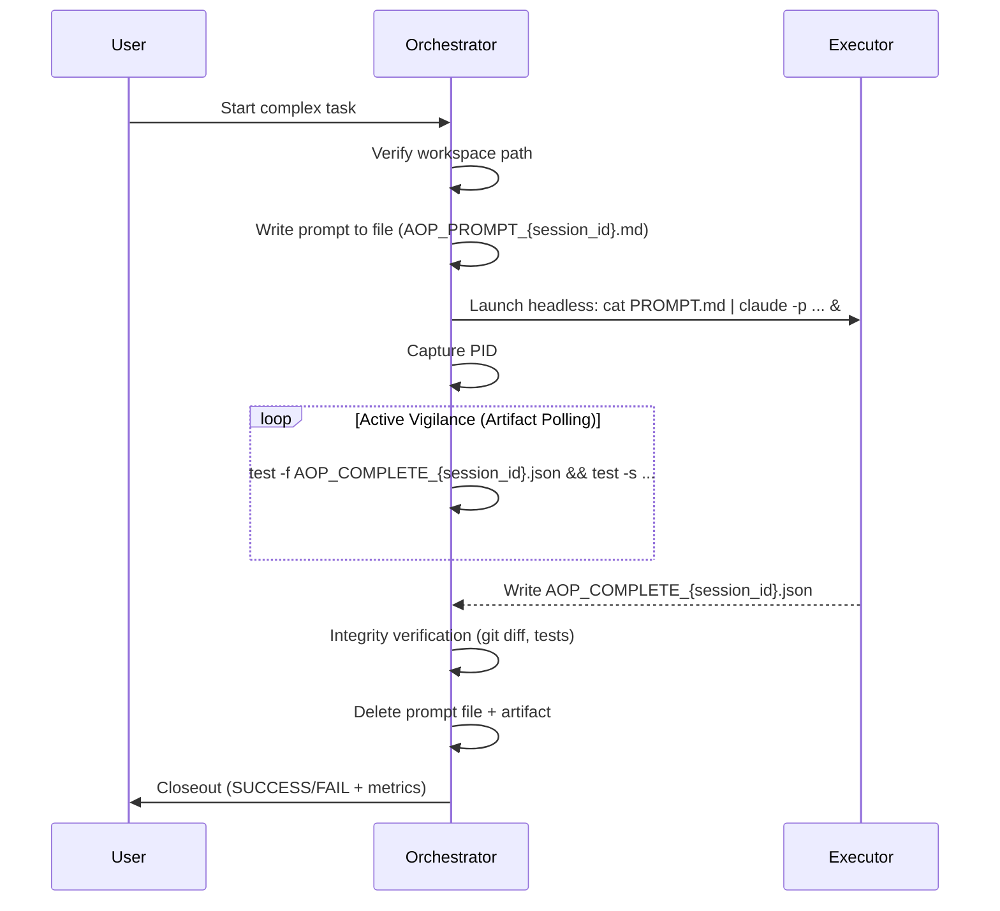

# Agent Orchestration Protocol (AOP)

**Skill ID:** `agent-orchestration-protocol`
**Version:** 3.0.0
**Status:** Production-Validated
**Category:** Multi-Agent Coordination

---

## What AOP Is — and What It Is NOT

AOP = launching real OS processes via shell commands. If you are not executing a shell command that spawns an independent OS process, you are NOT using AOP.

| Aspect | Internal Sub-agent (NOT AOP) | AOP Headless Session (Real AOP) |
| :--- | :--- | :--- |
| **Process** | Child of parent session | Independent OS process |
| **Context** | Shares parent context | Clean, isolated context |
| **Launch** | Agent tool / internal API call | `claude -p` / `codex exec` / `gemini -p` in shell |
| **Completion** | Synchronous return | Requires polling (Pillar 4) |
| **Pillar 1 compliant** | No | Yes |

**Rule:** If the Orchestrator does not run a shell command (`Bash` tool, terminal, PowerShell), it is NOT AOP. The Agent tool is useful — it is just a different pattern.

---

## Orchestration Flow



---

## The Seven Pillars of AOP

Use this as an actionable checklist. Each pillar has a definition, implementation command, and a verification test.

---

### Pillar 1: Environment Isolation

**Definition:** Executor Agents operate in clean, independent shell environments — separate OS processes with no shared state.

**Implementation:**
```bash
# bash (primary)
cat AOP_PROMPT_${SESSION_ID}.md | claude -p --dangerously-skip-permissions --model claude-sonnet-4-6 &
EXECUTOR_PID=$!

# PowerShell (alternative)
Start-Process -FilePath "claude" -ArgumentList "-p --dangerously-skip-permissions --model claude-sonnet-4-6" -RedirectStandardInput "AOP_PROMPT_${SESSION_ID}.md" -PassThru
```

**Verification:** `ps aux | grep claude` (bash) or `Get-Process claude` (PowerShell) — confirms independent process with its own PID.

---

### Pillar 2: Absolute Referencing

**Definition:** All file and directory references use absolute paths. Relative paths cause silent failures when working directories differ between Orchestrator and Executor.

**Implementation:**
```bash
# Always specify full paths in executor prompts
# Good:  /c/ai/claude-intelligence-hub/agent-orchestration-protocol/SKILL.md
# Bad:   ./SKILL.md   or   ../agent-orchestration-protocol/SKILL.md
```

**Verification:** Grep the prompt file for relative paths before launch:
```bash
grep -n '^\./\|^\.\.\/' AOP_PROMPT_${SESSION_ID}.md && echo "WARN: relative paths found"
```

---

### Pillar 3: Permission Bypass (Trusted Workspaces Only)

**Definition:** Automate permission approval only in pre-approved, known-safe directories. The bypass flags skip interactive prompts — they do NOT grant new capabilities or protect against bad instructions.

**Implementation:**
```bash
# Claude Code
claude -p --dangerously-skip-permissions --model claude-sonnet-4-6

# Codex
codex exec --dangerously-bypass-approvals-and-sandbox 'instructions'

# Gemini
gemini --approval-mode yolo -p "instructions"
```

**Verification:** Confirm workspace path is in the trusted allow-list before launch (see Security Boundaries section).

---

### Pillar 4: Active Vigilance (Polling)

**Definition:** The Orchestrator monitors task completion by polling for a completion artifact. It never waits synchronously.

**Implementation:**
```bash
# Non-empty file check (standard)
test -f AOP_COMPLETE_${SESSION_ID}.json && test -s AOP_COMPLETE_${SESSION_ID}.json

# Adaptive polling loop (30s for first 2 min, then 60s)
POLLS=0; MAX_POLLS=20
while [ $POLLS -lt $MAX_POLLS ]; do
  if test -f AOP_COMPLETE_${SESSION_ID}.json && test -s AOP_COMPLETE_${SESSION_ID}.json; then
    echo "Artifact detected."; cat AOP_COMPLETE_${SESSION_ID}.json; break
  fi
  POLLS=$((POLLS+1))
  [ $POLLS -le 4 ] && sleep 30 || sleep 60
done
[ $POLLS -ge $MAX_POLLS ] && echo "TIMEOUT: kill $EXECUTOR_PID"
```

**Verification:** Confirm `status` field in the artifact is `SUCCESS` before proceeding.

---

### Pillar 5: Integrity Verification

**Definition:** The Orchestrator independently verifies the Executor's work — not by trusting the completion artifact alone, but by checking actual outputs.

**Implementation:**
```bash
# Check expected files exist and are non-empty
test -s /c/ai/target-project/output.md && echo "OK" || echo "FAIL"

# Run test suite if applicable
cd /c/ai/target-project && python -m pytest tests/ -q

# Spot-check git diff
git diff HEAD~1 -- path/to/critical/file.py
```

**Verification:** Every verification step must produce explicit PASS/FAIL output. Do not assume.

---

### Pillar 6: Closeout Protocol

**Definition:** The Orchestrator always returns a final status report to the user — either `SUCCESS` or `FAIL` — with concrete evidence.

**Implementation:**
```
STATUS: SUCCESS
- Executor: Claude Sonnet 4.6 (headless AOP)
- Files changed: 3 (agent.py, tests/test_agent.py, CHANGELOG.md)
- Tests: 372/372 PASS
- Duration: ~9 min (84 tool calls)
- Artifact: AOP_COMPLETE_a1b2.json (verified)
```

**Verification:** No closeout without evidence. If you cannot point to a verification result, the status is FAIL.

---

### Pillar 7: Constraint Adaptation

**Definition:** If the Orchestrator cannot directly access a resource (sandbox restriction, path boundary, tool limitation), it delegates the constrained operation to an appropriately-scoped executor.

**Implementation:**
```bash
# Orchestrator cannot access /c/ai/protected-dir directly
# Delegate the read/verify task to a headless agent that CAN
echo "Read /c/ai/protected-dir/result.json and return its content." \
  | claude -p --dangerously-skip-permissions --model claude-sonnet-4-6
```

**Verification:** Confirm the delegated agent's response contains the expected data before proceeding.

---

## Security Boundaries

### Trusted Workspace Definition

A **trusted workspace** is a directory explicitly pre-approved for bypass execution. The current allow-list:

```
C:\ai\                          # Primary AI workspace
C:\ai\_worktrees\               # Git worktrees
C:\Workspaces\llms_projects\    # Legacy project directory
C:\ai\temp\                     # Ephemeral work
```

**Before any bypass execution, verify the path is in this list:**
```bash
TARGET="/c/ai/my-project"
echo "$TARGET" | grep -qE '^/c/ai/|^/c/Workspaces/llms_projects' \
  && echo "TRUSTED" || echo "NOT TRUSTED - abort"
```

### What Bypass Flags Do and Do NOT Do

| Bypass flag | What it does | What it does NOT do |
| :--- | :--- | :--- |
| `--dangerously-skip-permissions` | Skips interactive Y/N prompts | Does not expand what the agent can access |
| `--dangerously-bypass-approvals-and-sandbox` | Disables sandboxing and approval gates | Does not grant filesystem permissions the shell doesn't already have |
| `--approval-mode yolo` | Auto-approves all Gemini actions | Does not bypass OS-level permissions |

### Mandatory `write_paths` Declaration

Every executor prompt MUST declare what it is allowed to write:

```
WRITE SCOPE (you may ONLY write to these paths):
- /c/ai/my-project/src/
- /c/ai/my-project/tests/
- /c/ai/my-project/AOP_COMPLETE_{session_id}.json

DO NOT write to: /c/ai/other-project/, system directories, or credential stores.
```

### Post-Execution Verification Recommendation

After each executor session, the Orchestrator runs:
```bash
git -C /c/ai/target-project diff --name-only HEAD~1
```
Compare this list to the declared write scope. Any file outside the scope = security incident.

### DO NOT USE bypass for:
- Production repositories without an explicit PR review step
- System directories (`C:\Windows\`, `/etc/`, `/usr/`)
- Credential stores, `.env` files, or secrets vaults
- Any path not in the trusted workspace allow-list above

---

## Execution Standard

### Primary Pattern: File-Based Prompt (Recommended)

Write the executor prompt to a file and pipe it. This avoids all escaping issues with code snippets, tables, JSON, and special characters.

```bash
# Step 1: Write prompt to file (Orchestrator)
SESSION_ID="$(date +%s | tail -c 5)"  # 5-char session suffix
PROMPT_FILE="AOP_PROMPT_${SESSION_ID}.md"
ARTIFACT="AOP_COMPLETE_${SESSION_ID}.json"

cat > "${PROMPT_FILE}" << 'PROMPT_EOF'
You are an Executor Agent. Your working directory: /c/ai/target-project

WRITE SCOPE: /c/ai/target-project/src/, /c/ai/target-project/AOP_COMPLETE_${SESSION_ID}.json

TASK:
[detailed task instructions here]

COMPLETION REQUIREMENT:
As your LAST action, write this file: /c/ai/target-project/AOP_COMPLETE_${SESSION_ID}.json
{
  "status": "SUCCESS",
  "task_id": "round-1-rewrite",
  "session_id": "${SESSION_ID}",
  "timestamp": "<ISO timestamp>",
  "executor": "Claude Sonnet 4.6 (headless AOP)",
  "files_changed": ["list of changed files"]
}
PROMPT_EOF

# Step 2: Launch headless executor
cd /c/ai/target-project
cat "${PROMPT_FILE}" | claude -p --dangerously-skip-permissions --model claude-sonnet-4-6 &
EXECUTOR_PID=$!
echo "Executor PID: $EXECUTOR_PID"
```

**PowerShell alternative:**
```powershell
Set-Location C:\ai\target-project
Get-Content "AOP_PROMPT_${SESSION_ID}.md" | claude -p --dangerously-skip-permissions --model claude-sonnet-4-6
```

### Inline Prompt Pattern (Simple tasks only)

Use only when the instruction has no special characters, code blocks, or JSON:
```bash
cd /c/ai/target-project
claude -p "Create a file called hello.md with content 'AOP test'." \
  --dangerously-skip-permissions --model claude-sonnet-4-6 &
EXECUTOR_PID=$!
```

### Cleanup Protocol

After a successful execution:
```bash
rm -f "${PROMPT_FILE}"      # Delete prompt file
rm -f "${ARTIFACT}"         # Delete completion artifact
echo "Cleanup complete."
```

### Artifact Naming Convention

Use the session suffix for parallel-safe naming:
```
AOP_PROMPT_{session_id}.md         # Prompt file
AOP_COMPLETE_{session_id}.json     # Completion artifact
error_{session_id}.json            # Error artifact (if failed)
```

---

## Polling & Completion

All polling uses artifact-based detection. Do not parse stdout.

### Standard Polling Loop

```bash
POLLS=0
MAX_POLLS=20          # 20 polls = ~14 min max (4 × 30s + 16 × 60s)
SESSION_ID="a1b2"     # Set to your actual session suffix
ARTIFACT="AOP_COMPLETE_${SESSION_ID}.json"

while [ $POLLS -lt $MAX_POLLS ]; do
  if test -f "${ARTIFACT}" && test -s "${ARTIFACT}"; then
    echo "=== Artifact detected at poll ${POLLS} ==="
    cat "${ARTIFACT}"
    break
  fi
  POLLS=$((POLLS + 1))
  echo "Poll ${POLLS}/${MAX_POLLS}: not yet..."
  # Adaptive interval: 30s for first 4 polls (~2 min), then 60s
  [ $POLLS -le 4 ] && sleep 30 || sleep 60
done

if [ $POLLS -ge $MAX_POLLS ]; then
  echo "TIMEOUT after ${MAX_POLLS} polls. Killing executor PID ${EXECUTOR_PID}."
  kill "${EXECUTOR_PID}" 2>/dev/null
fi
```

### Key Rules

- **Non-empty check is mandatory:** `test -f FILE && test -s FILE` — a 0-byte file means the executor crashed mid-write.
- **Maximum 20 polls:** Never poll indefinitely. After MAX_POLLS, kill the executor and escalate.
- **Adaptive intervals:** 30s for the first 2 minutes (4 polls), then 60s. Balances responsiveness and CPU.
- **PID capture at launch:** Always capture `$!` immediately after the `&` launch. You need it for the timeout kill.

---

## Error Recovery

### Timeout Recovery

```bash
# 1. Kill the executor
kill "${EXECUTOR_PID}" 2>/dev/null
sleep 2
# Force kill if still running
kill -9 "${EXECUTOR_PID}" 2>/dev/null

# 2. Check for partial results
git -C /c/ai/target-project diff --name-only HEAD

# 3. Decide: retry with narrower scope, or abort and report FAIL
```

### Executor Crash Recovery

```bash
# 1. Check for error artifact
ERROR_FILE="error_${SESSION_ID}.json"
test -f "${ERROR_FILE}" && cat "${ERROR_FILE}" || echo "No error artifact found."

# 2. Check git state
git -C /c/ai/target-project status
git -C /c/ai/target-project log --oneline -3

# 3. Decide: retry (idempotent tasks only) or abort
# Retry only if git status shows no partial changes
```

### Orchestrator Crash: Detecting Orphaned Processes

```bash
# Find any running headless claude sessions
ps aux | grep 'claude -p' | grep -v grep

# Kill orphaned processes by PID
kill <orphan_pid>

# Check what was last written
git -C /c/ai/target-project log --oneline -3
git -C /c/ai/target-project status
```

### Rollback Protocol

| Scenario | Rollback method |
| :--- | :--- |
| Executor wrote bad content but committed | `git revert HEAD` in target project |
| Executor wrote bad content, not committed | `git checkout -- .` in target project |
| Executor wrote to files outside scope | Restore from `git stash` if snapshot was taken; otherwise `git checkout <sha> -- file` |
| Files outside git | Orchestrator takes file copy snapshot before launch: `cp target.md target.md.bak` |

**Snapshot rule:** For any file outside git tracking, the Orchestrator MUST copy it before launching the executor:
```bash
cp /c/ai/config/settings.json /c/ai/config/settings.json.bak_${SESSION_ID}
```

---

## Governance (Lightweight)

### Audit Trail

The Orchestrator logs key events to a JSONL file — one JSON object per line, append-only:

```bash
AUDIT_LOG="/c/ai/aop-audit.jsonl"

log_event() {
  echo "{\"timestamp\":\"$(date -u +%Y-%m-%dT%H:%M:%SZ)\",\"task_id\":\"$1\",\"executor\":\"$2\",\"status\":\"$3\",\"files_changed\":$4}" >> "${AUDIT_LOG}"
}

# Usage:
log_event "round-1-rewrite" "claude-sonnet-4-6" "SUCCESS" "[\"SKILL.md\"]"
```

**Minimum required fields:**

| Field | Type | Description |
| :--- | :--- | :--- |
| `timestamp` | ISO 8601 | Event time (UTC) |
| `task_id` | string | Human-readable task identifier |
| `executor` | string | Model + mode (e.g., `claude-sonnet-4-6 headless`) |
| `status` | `SUCCESS` or `FAIL` | Final outcome |
| `files_changed` | array | List of file paths written by executor |

**Optional fields:** `findings_count`, `cost_tracking`, `error_details`, `polls_to_detection`, `duration_seconds`

### Default Guard Rails

Apply these defaults to every orchestration unless explicitly overridden:

| Guard rail | Default |
| :--- | :--- |
| Poll timeout | 20 polls max (~14 min) |
| Kill on timeout | Yes — `kill $EXECUTOR_PID` |
| Require completion artifact | Yes — `SUCCESS` status required |
| Write scope declaration | Mandatory in every executor prompt |
| Post-execution git diff check | Recommended |

### Cost Tracking

Executors self-report in the completion artifact:
```json
{
  "cost_tracking": {
    "tool_calls": 84,
    "duration_min": 9,
    "model": "claude-sonnet-4-6"
  }
}
```

---

## Cross-LLM Command Reference

### Launch Commands

| Task | Claude Code | Codex | Gemini |
| :--- | :--- | :--- | :--- |
| **Headless execution** | `claude -p "..."` | `codex exec "..."` | `gemini -p "..."` |
| **File-based prompt** | `cat FILE.md \| claude -p` | Not supported natively | Not supported natively |
| **Bypass sandbox/approval** | `--dangerously-skip-permissions` | `--dangerously-bypass-approvals-and-sandbox` | `--approval-mode yolo` |
| **Model selection** | `--model claude-sonnet-4-6` | `--model o4-mini` (or similar) | `--model gemini-2.0-flash` |
| **Background execution** | Append `&` in bash | Append `&` in bash | Append `&` in bash |
| **Set workspace** | `cd /c/ai/project` before launch | `cd /c/ai/project` before launch | `cd /c/ai/project` before launch |
| **Git bypass (non-git dir)** | N/A | `--skip-git-repo-check` | N/A |

### Known CLI Quirks

- **Gemini `-y` alias:** The `-y` flag as an alias for `--approval-mode yolo` is unverified. Use the full flag: `--approval-mode yolo`.
- **Codex single quotes:** Codex CLI parses instructions wrapped in single quotes. Double quotes inside single-quoted instructions cause parse errors — use escaped chars or the file-based pattern.
- **Claude inline escaping:** Backticks, `$`, and `"` in inline `-p` instructions cause shell expansion issues. Use the file-based prompt pattern for any instruction with code snippets.
- **PowerShell pipe syntax:** In PowerShell, use `Get-Content FILE | claude -p` instead of `cat FILE | claude -p` for reliability.
- **Background PID in PowerShell:** Use `Start-Process ... -PassThru | Select-Object -ExpandProperty Id` to capture the PID.

### Bash vs PowerShell Quick Reference

```bash
# bash (primary — use this)
cd /c/ai/target-project
cat AOP_PROMPT_${SESSION_ID}.md | claude -p --dangerously-skip-permissions --model claude-sonnet-4-6 &
EXECUTOR_PID=$!
```

```powershell
# PowerShell (alternative — when bash is unavailable)
Set-Location C:\ai\target-project
$proc = Start-Process claude -ArgumentList "-p --dangerously-skip-permissions --model claude-sonnet-4-6" -RedirectStandardInput "AOP_PROMPT_${SESSION_ID}.md" -PassThru
$EXECUTOR_PID = $proc.Id
```

---

## Completion Artifact Schema

### Required Fields

```json
{
  "status": "SUCCESS",
  "task_id": "round-1-skill-rewrite",
  "session_id": "a1b2c",
  "timestamp": "2026-03-17T14:30:00-03:00",
  "executor": "Claude Sonnet 4.6 (headless AOP)",
  "files_changed": ["agent-orchestration-protocol/SKILL.md"]
}
```

| Field | Required | Values |
| :--- | :--- | :--- |
| `status` | Yes | `"SUCCESS"` or `"FAILURE"` |
| `task_id` | Yes | Human-readable task name |
| `session_id` | Yes | Short suffix used in file naming |
| `timestamp` | Yes | ISO 8601 with timezone |
| `executor` | Yes | Model name + mode |
| `files_changed` | Yes | Array of absolute or repo-relative paths |

### Optional Fields

```json
{
  "findings_count": 11,
  "cost_tracking": {
    "tool_calls": 84,
    "duration_min": 9,
    "model": "claude-sonnet-4-6"
  },
  "error_details": null
}
```

### Naming Convention

```
AOP_COMPLETE_{session_id}.json
```

Where `session_id` is the same short suffix used in the prompt file name. This ensures prompt file and artifact are always paired.

**Error artifact (on failure):**
```json
{
  "status": "FAILURE",
  "failed_step": "Step 3: Writing to SKILL.md",
  "reason": "Permission denied",
  "details": "Agent did not have write access to the specified path.",
  "executor": "Claude Sonnet 4.6 (headless AOP)",
  "session_id": "a1b2c"
}
```

---

## Worked Examples Reference

Full prompt templates and production-validated examples are in [AOP_WORKED_EXAMPLES.md](./AOP_WORKED_EXAMPLES.md).

Key patterns documented there:
- Basic connectivity test (Prompt 1)
- Sequential two-agent orchestration (Prompt 4)
- File-based prompt + artifact polling — production pattern (Prompt 15)
- Headless documentation executor (Prompt 16)
- Cross-LLM chain delegation: Claude → Codex → Gemini (Prompt 14)

Real-world case studies are in [orchestrations/](./orchestrations/).

---

## Version History

- **v3.0.0** — Unified rewrite. Single protocol, no V1/V2 split. New sections: Security Boundaries, Error Recovery, Governance. Standardized on bash primary. File-based prompt as default. Completion artifact schema formalized. Cross-LLM table updated with known quirks.
- **v2.1.0** — Production-validated. File-based prompt pattern. Artifact-based polling. Sub-agent vs headless distinction. Real metrics from docx-indexer execution (11 findings, 372/372 tests PASS).
- **v2.0.0** — JSON-native protocol, role-based architecture, Pydantic v2, 141 tests.
- **v1.3.0** — Seven Pillars, Flexible Routing, Execution Standards.
