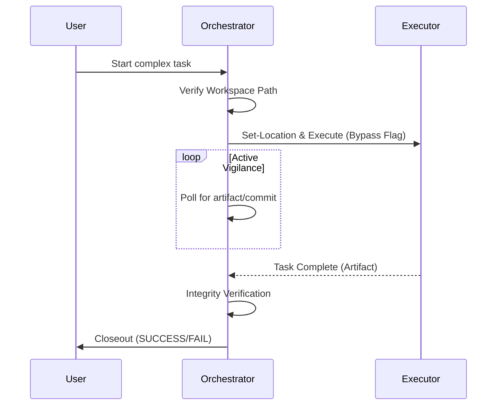

# 🤖 Agent Orchestration Protocol (AOP)

**Skill ID:** `agent-orchestration-protocol`
**Version:** 2.1.0
**Status:** Production-Validated
**Category:** Multi-Agent Coordination
**Author:** Forge (Senior Software Engineer & Context Specialist)

---

## 🎯 Overview

The **Agent Orchestration Protocol (AOP)** is a framework that enables Claude-based agents to orchestrate complex tasks across multiple autonomous agents through CLI interfaces. This skill transforms any agent into an **Orchestrator Agent** capable of delegating, monitoring, and validating work performed by **Executor Agents**.

<details>
<summary><b>📊 View Orchestration Event Flow</b></summary>



</details>

---

## 🏛️ The Seven Pillars of AOP

1. **Environment Isolation:** Launch agents in isolated shell environments.
2. **Absolute Referencing:** Always use absolute paths for file operations.
3. **Permission Bypass:** Automate permission approval for trusted workspaces.
4. **Active Vigilance (Polling):** Implement verification loops to monitor task completion.
5. **Integrity Verification:** Validate generated artifacts.
6. **Closeout Protocol:** Return explicit status reports (`SUCCESS` or `FAIL`).
7. **Constraint Adaptation:** Delegate monitoring tasks if sandbox constraints prevent direct access.

---

## 🔒 Flexible Security Routing & Execution Standard (MANDATORY)

To guarantee reliable execution and resolve sandbox initialization issues, orchestrators MUST strictly follow this execution standard.

### The Workspace Routing Rule
Orchestrators can route executors to **ANY trusted, pre-configured project directory** (e.g., `C:\ai`, `C:\Workspaces`) using the `Set-Location` syntax, provided the orchestrator explicitly verifies the path before handover.

### The Executor Agent Routing Standard
The `codex` and `gemini` executor agents are fully compliant. Failures are typically due to incorrect directory contexts. You MUST use one of the following patterns, utilizing the appropriate bypass flag:

<details>
<summary><b>💻 View Mandatory PowerShell Execution Patterns</b></summary>

**For Codex (Emma):**
**Option A (Simple, reliable execution):**
```powershell
Set-Location <Target_Path>
codex exec --dangerously-bypass-approvals-and-sandbox '<Complex_Instructions_Wrapped_In_Single_Quotes>'
```

**Option B (One-liner - Highly Recommended for automated orchestration):**
```powershell
Set-Location <Target_Path>; codex exec --dangerously-bypass-approvals-and-sandbox '<Complex_Instructions_Wrapped_In_Single_Quotes>'
```

**For Claude Code (Magneto):**
**Option A (Inline prompt):**
```powershell
Set-Location <Target_Path>; claude -p "<Instructions>" --dangerously-skip-permissions --model claude-sonnet-4-6
```

**Option B (File-based prompt - Recommended for complex instructions):**
```powershell
Set-Location <Target_Path>; cat PROMPT_FILE.md | claude -p --dangerously-skip-permissions --model claude-sonnet-4-6
```

> **Why file-based?** Complex multi-step prompts with code snippets, tables, and special characters break when passed inline. Writing the prompt to a `.md` file first and piping via `cat` avoids all escaping issues and allows the Orchestrator to craft richer, more detailed instructions.

**For Gemini (Forge):**
**Option B (One-liner):**
```powershell
Set-Location <Target_Path>; gemini --approval-mode yolo -p "<Complex_Instructions_Wrapped_In_Double_Quotes>"
```

**Option C (Spawn in a completely new terminal instance):**
```powershell
Start-Process powershell -WorkingDirectory <Target_Path>
```

</details>

---

## 🚑 Fallback & Recovery

### Standardized Error Reporting
Executor Agents should output an `error.json` file in the root of their workspace upon failure to aid the Orchestrator.

<details>
<summary><b>📄 Example error.json</b></summary>

```json
{
  "failed_step": "Step 3: Writing to file '...'",
  "reason": "Permission denied",
  "details": "The agent did not have write access.",
  "executor_agent_id": "Emma" 
}
```

</details>

### Polling Optimizations
- **Boolean Strategy:** Ask sub-agents to "Return ONLY 'YES' or 'NO'" to prevent hallucinations.
- **Delegate the Loop:** Delegate the entire `while` loop to a single long-lived agent instead of spawning an agent per check.
- **Artifact-Based Polling:** Have the Executor create a JSON completion file (e.g., `AOP_COMPLETE.json`) as its last step. The Orchestrator polls for this file's existence — simpler and more reliable than parsing stdout.

### Completion Artifact Pattern
```json
{
  "status": "SUCCESS",
  "task": "description-of-task",
  "files_updated": ["file1.md", "file2.py"],
  "timestamp": "2026-03-16T18:00:00-03:00",
  "executor": "Claude Sonnet 4.6 (headless AOP session)"
}
```

---

## Sub-agents vs Headless AOP (Critical Distinction)

Tools like Claude Code's `Agent tool`, Codex's internal sub-agents, or Gemini's sub-processes are **NOT** AOP headless sessions. They run inside the parent process and share its context.

| Aspect | Internal Sub-agent | AOP Headless (Real) |
| :--- | :--- | :--- |
| **Process** | Child of parent session | Independent OS process |
| **Context** | Shares parent context | Clean, dedicated context |
| **Command** | Agent tool / internal API | `claude -p` / `codex exec` / `gemini -p` in shell |
| **Polling** | Synchronous return | Requires active polling (Pillar 4) |
| **Pillar 1 compliant** | No | Yes |

**Rule:** If the Orchestrator does not launch a shell command (`Bash`, `powershell`, terminal), it is NOT AOP. Sub-agents are useful but they are a different pattern.

---

## 📚 Related Documentation

- [README.md](./README.md) - Complete onboarding guide
- [AOP_WORKED_EXAMPLES.md](./AOP_WORKED_EXAMPLES.md) - Production-validated prompt cookbook
- [orchestrations/](./orchestrations/) - Real-world orchestration case studies with complete execution reports
  - [Chain Delegation with Sub-Orchestration](./orchestrations/2026-02-25_chain-delegation/) - Multi-level delegation (Claude → OpenAI → Google) with 100% success rate

---

### Cross-LLM Command Reference

| Task | Gemini CLI (`gemini`) | Codex CLI (`codex`) | Claude Code (`claude`) |
| :--- | :--- | :--- | :--- |
| **Execution (Standard)** | `gemini -p "..."` | `codex exec "..."` | `claude -p "..."` |
| **Bypass Sandbox / Approval** | `--approval-mode yolo` or `-y` | `--dangerously-bypass-approvals-and-sandbox` | `--dangerously-skip-permissions` |
| **Set Workspace / Context** | `--include-directories <path>` | Handled via `Set-Location` prior to execution | Handled via `Set-Location` prior to execution |
| **Git Bypass** | *N/A (Works outside git)* | `--skip-git-repo-check` | *N/A* |

**Example: Claude or Codex orchestrating Gemini (Forge):**
```powershell
Set-Location C:\ai\target_dir; gemini --approval-mode yolo -p "Forge, execute Phase 1: create file X. Output ONLY the word 'YES' upon completion."
```

---

**Version History:**
- **v2.1.0** - Production-validated Claude-to-Claude headless AOP. File-based prompt pattern. Artifact-based polling. Sub-agent vs Headless distinction documented. Real metrics from docx-indexer W1+W2 execution (11 findings, 372/372 tests PASS).
- **v2.0.0** - AOP JSON V2: JSON-native protocol, role-based architecture, guard rails, audit system.
- **v1.3.0** - Added Seven Pillars, Flexible Routing, UX/UI Upgrades, and Execution Standards.

---
## 🆕 AOP V2 — JSON-Native Protocol

**Version 2.0.0** introduces a fully JSON-native orchestration protocol with:

- **Role-based architecture**: Any model can assume Orchestrator, Executor, Router, or Governance roles.
- **Structured envelopes**: JSON TASK and RESPONSE envelopes with Pydantic v2 validation.
- **Guard rails**: Budget enforcement, payload limits, timeout management, safety policies.
- **Audit trails**: Full session observability with structured JSONL records.
- **V1 backward compatibility**: Automatic fallback for agents that only support V1.

### V2 Technical Stack
- Python 3.11+, Pydantic v2
- JSON Schema validation for all messages
- 141 tests, 92% coverage
- Atomic audit trail writes

See `v2/` directory for full implementation and `v2/02_docs/` for contract and plan.