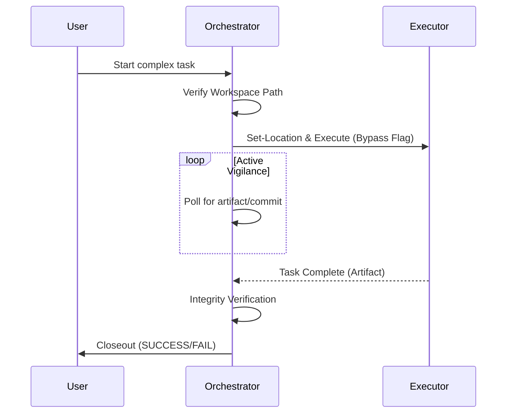

# 🤖 Agent Orchestration Protocol (AOP)

**Skill ID:** `agent-orchestration-protocol`
**Version:** 1.3.0
**Status:** Production-Ready
**Category:** Multi-Agent Coordination
**Author:** Forge (Senior Software Engineer & Context Specialist)

---

## 🎯 Overview

The **Agent Orchestration Protocol (AOP)** is a framework that enables Claude-based agents to orchestrate complex tasks across multiple autonomous agents through CLI interfaces. This skill transforms any agent into an **Orchestrator Agent** capable of delegating, monitoring, and validating work performed by **Executor Agents**.

<details>
<summary><b>📊 View Orchestration Event Flow</b></summary>


</details>

---

## 🏛️ The Seven Pillars of AOP

1. **Environment Isolation:** Launch agents in isolated shell environments.
2. **Absolute Referencing:** Always use absolute paths for file operations.
3. **Permission Bypass:** Automate permission approval for trusted workspaces.
4. **Active Vigilance (Polling):** Implement verification loops to monitor task completion.
5. **Integrity Verification:** Validate generated artifacts.
6. **Closeout Protocol:** Return explicit status reports (`SUCCESS` or `FAIL`).
7. **Constraint Adaptation:** Delegate monitoring tasks if sandbox constraints prevent direct access.

---

## 🔒 Flexible Security Routing & Execution Standard (MANDATORY)

To guarantee reliable execution and resolve sandbox initialization issues, orchestrators MUST strictly follow this execution standard.

### The Workspace Routing Rule
Orchestrators can route executors to **ANY trusted, pre-configured project directory** (e.g., `C:\ai`, `C:\Workspaces`) using the `Set-Location` syntax, provided the orchestrator explicitly verifies the path before handover.

### The Codex Execution Standard
The `codex` executor agent is fully compliant. Failures are typically due to incorrect directory contexts. You MUST use one of the following patterns, utilizing the `--dangerously-bypass-approvals-and-sandbox` flag:

<details>
<summary><b>💻 View Mandatory PowerShell Execution Patterns</b></summary>

**Option A (Simple, reliable execution):**
```powershell
Set-Location <Target_Path>
codex exec --dangerously-bypass-approvals-and-sandbox '<Complex_Instructions_Wrapped_In_Single_Quotes>'
```

**Option B (One-liner - Highly Recommended for automated orchestration):**
```powershell
Set-Location <Target_Path>; codex exec --dangerously-bypass-approvals-and-sandbox '<Complex_Instructions_Wrapped_In_Single_Quotes>'
```

**Option C (Spawn in a completely new terminal instance):**
```powershell
Start-Process powershell -WorkingDirectory <Target_Path>
```
</details>

---

## 🚑 Fallback & Recovery

### Standardized Error Reporting
Executor Agents should output an `error.json` file in the root of their workspace upon failure to aid the Orchestrator.

<details>
<summary><b>📄 Example error.json</b></summary>

```json
{
  "failed_step": "Step 3: Writing to file '...'",
  "reason": "Permission denied",
  "details": "The agent did not have write access.",
  "executor_agent_id": "Emma" 
}
```
</details>

### Polling Optimizations
- **Boolean Strategy:** Ask sub-agents to "Return ONLY 'YES' or 'NO'" to prevent hallucinations.
- **Delegate the Loop:** Delegate the entire `while` loop to a single long-lived agent instead of spawning an agent per check.

---

## 📚 Related Documentation

- [README.md](./README.md) - Complete onboarding guide
- [AOP_WORKED_EXAMPLES.md](./AOP_WORKED_EXAMPLES.md) - Production-validated prompt cookbook

---

### Cross-LLM Command Reference

| Task | Gemini CLI (`gemini`) | Codex CLI (`codex`) |
| :--- | :--- | :--- |
| **Bypass Sandbox** | `--approval-mode yolo` | `--dangerously-bypass-approvals-and-sandbox` |
| **Set Workspace** | `--include-directories <path>` | Handled via `Set-Location` prior to execution |

---

**Version History:**
- **v1.3.0** - Added Seven Pillars, Flexible Routing, UX/UI Upgrades, and Execution Standards.