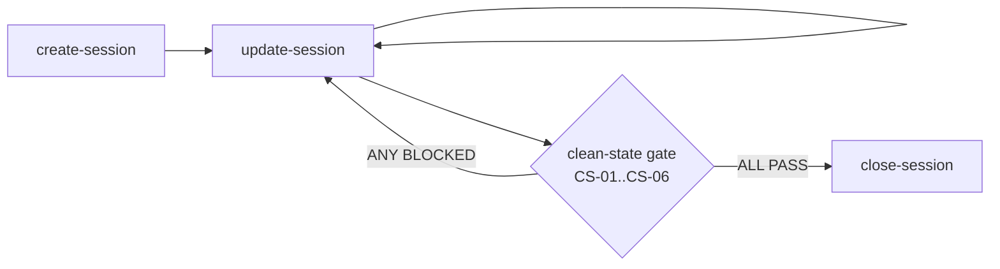
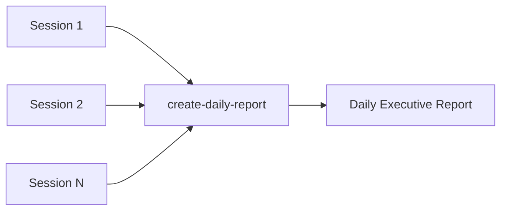
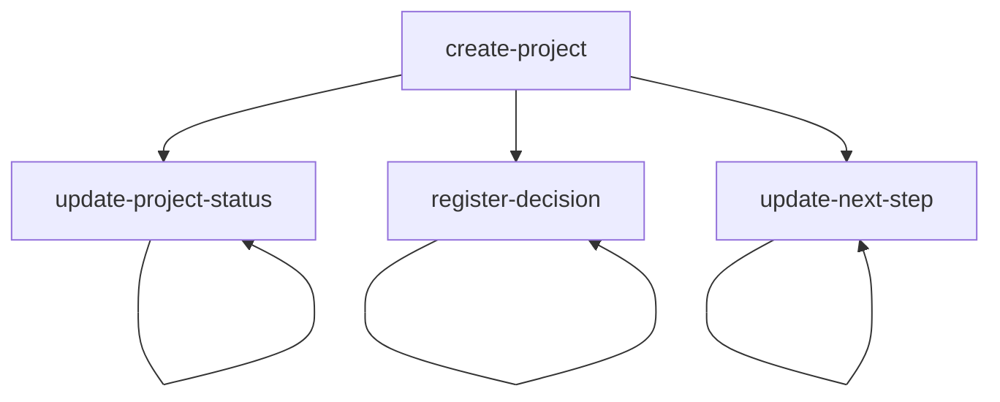

# daily-doc-information

> Session docs, daily reports, and project governance automation

**Version:** 1.0.0 | **Status:** Production | **Hub:** v2.15.0 | **Cross-agent:** Yes | **Cross-machine:** Yes

---

## What This Skill Does

`daily-doc-information` automates three interconnected layers of documentation for AI-driven engineering work. At the session layer, it creates structured session documents from a canonical template, tracks all in-session updates (decisions, validations, history), and enforces a clean-state gate before closing — preventing any session from being marked done before it is truly done.

At the daily layer, it consolidates all sessions from a given date into a single executive report, giving stakeholders and agents a clear, timestamped summary of what happened across all workstreams in a day.

At the project governance layer, it manages formal project folders with 5 operational documents (contract, status, decisions, next-step, notes). It creates new projects from templates, registers decisions at the top of the decision log, and keeps status and next-step docs always current.

Throughout all three layers, the skill enforces **identity** (canonical session discriminator), **hygiene** (no placeholders, no stale paths, timestamps coherent in both frontmatter and body), and **safety gates** (session closure is blocked unless all 6 clean-state criteria pass). The skill is agent-agnostic: it gives instructions in terms of "read file" and "write file" — each agent adapts to its own tools.

---

## Operations at a Glance

| Code | Layer | Description |
|---|---|---|
| `create-session` | Session lifecycle | Create a new session doc from template with canonical discriminator |
| `update-session` | Session lifecycle | Add structured content (history, decisions, validations, next action) |
| `close-session` | Session lifecycle | Evaluate 6 clean-state criteria; close only if all pass |
| `create-daily-report` | Daily reports | Consolidate all sessions for a date into one executive report |
| `create-project` | Project governance | Create a new project folder with 5 operational docs from templates |
| `update-project-status` | Project governance | Update the project `status-atual.md` |
| `register-decision` | Project governance | Prepend a new decision to `decisoes.md` |
| `update-next-step` | Project governance | Replace the current next step in `next-step.md` |

---

## Architecture & Flow

### Session Lifecycle



### Daily Report Flow



### Project Governance Flow



---

## Quick Start

Invoke the skill directly:

```
/daily-doc-information
```

Or use natural language — the agent detects the intent and maps it to the correct operation:

- "Create a new session doc for project X"
- "Update the session with this decision"
- "Close the current session"
- "Create today's daily report"
- "Create a new project called X"
- "Register decision: we're using Opus for the prototype"
- "Update the next step to Y"

---

## Usage Examples

### Example 1: Creating a session doc

```
User: "Open a new session doc for project docx-indexer"

Agent invokes: create-session
  session_id: a1b2c3d4-e5f6-7890-abcd-ef1234567890
  session_id_short: a1b2c3d4
  project: docx-indexer
  context_type: Project
  session_name: "Magneto Workstream - docx-indexer deep analysis"
  output_path: C:\ai\obsidian\CIH\ai-sessions\2026-03\session-a1b2c3d4-2026-03-18-magneto.md

Result: New session doc created.
        Canonical discriminator: a1b2c3d4-DESKTOP-PC-magneto-2026-03-18
        Status: in_progress
```

### Example 2: Closing a session with clean-state gate

```
User: "Close the current session"

Agent invokes: close-session
  Evaluates 6 clean-state criteria:
    CS-01 next_action single and explicit ........... PASS
    CS-02 blockers declared ......................... PASS
    CS-03 at least one decision recorded ............ PASS
    CS-04 at least one validation with result ........ PASS
    CS-05 temporary artifacts accounted for ......... PASS
    CS-06 commit/push justification stated .......... BLOCKED

Gate result: BLOCKED
  CS-06: No commit hash recorded and no explicit "no changes" statement found.
  → Session NOT modified. Agent must resolve CS-06 before retrying.
```

### Example 3: Creating a new project

```
User: "Create a new project called llmx-auto-learn"

Agent invokes: create-project
  project_name: llmx-auto-learn
  project_type: skill

Result: Project folder created at C:\ai\obsidian\CIH\projects\skills\llmx-auto-learn\
  Created: 01-overview\overview.md
  Created: 02-planning\contrato-g01.md
  Created: 03-spec\spec-round-01.md
  Created: 04-tests\validation-matrix.md
  Created: 05-audits\audit-round-01.md
  5 operational docs initialized from templates.
```

### Example 4: Registering a decision

```
User: "Register decision: we're using Opus for the prototype"

Agent invokes: register-decision
  decision: "Opus 4.6 selected for prototype implementation"
  reason: "Complexity requires stronger reasoning capabilities"
  impact: "All AOP headless dispatches will use claude-opus-4-6"

Result: New entry prepended at TOP of decisoes.md
        (newest-first order enforced, DH-03)
```

---

## Safety & Guardrails

The skill enforces multiple layers of safety:

| Layer | Count | What it covers |
|---|---|---|
| Skip conditions | 12 | Abort before any work starts (missing inputs, wrong operation, path outside boundary, etc.) |
| Failure modes | 16 | Abort mid-execution with specific error (placeholder found, timestamps mismatch, etc.) |
| Prohibited behaviors | 15 | Hard rules never broken (no fabricated IDs, no frozen-doc writes, no timestamp invention) |
| Documentation hygiene | 13 | Rules governing format, timestamp coherence, history order, placeholder clearance |
| Clean-state gate | 6 criteria | Session closure requires ALL 6 to pass; any failure blocks the close |

**Key safety rules:**
- **Never fabricates session IDs** — `session_id` must be provided externally; the skill never generates UUIDs
- **Never touches frozen legacy docs** — documents predating 2026-03-12 are read-only
- **Write surface boundaries** — the skill can only write to `ai-sessions/`, `daily-reports/`, and `projects/` within `{BASE}\obsidian\CIH\`. No writes anywhere else.
- **Timestamp coherence** — `last_updated_at_local` must match in both frontmatter and body; any mismatch triggers FM-04
- **No placeholders in output** — any `{{TOKEN}}` remaining in written documents triggers FM-07

---

## Cross-Agent Compatibility

This skill runs on any agent that can read and write markdown files. Instructions are written as "read file X" / "write file Y" — each agent translates these to its own tooling.

| Provider | Agent | Status |
|---|---|---|
| Anthropic | Claude Code (Sonnet / Opus) | Tested |
| OpenAI | Codex | Tested |
| Google | Gemini | Tested |
| Any | Any LLM with file I/O | Compatible |

---

## Cross-Machine Portability

- **Base path:** `C:\ai\` (configurable per owner)
- **No hardcoded user paths** — never uses `C:\Users\{username}\`
- **Identical subpath structure** across machines
- **Templates embedded** in `SKILL.md` — no external template files or dependencies
- **Machine-specific values** (hostname, OS user, timezone) are captured at runtime via universal inputs, never hardcoded

To use on a machine with a different base path, update `{BASE}` — all internal subpaths remain the same.

---

## Project Structure

```
claude-intelligence-hub/daily-doc-information/
  SKILL.md                        # Main skill definition (~1300 lines, 8 operations)
  .metadata                       # Version and metadata (JSON)
  README.md                       # This file
  tests/
    test-plan.md                  # 35 test cases across all 8 operations
    validation-checklist.md       # Quick validation checklist
    test-fixtures/                # 16 test fixtures (8 positive + 8 negative)
    test-expected-outputs/        # 8 expected output specifications
    integration/                  # Integration test results (162 checks)
    g02-audit/                    # G-02 final audit report
```

---

## Development History

| Date | Milestone |
|---|---|
| 2026-03-14 | Project formally opened |
| 2026-03-15 | Rounds 01-04 (specs) completed and audited PASS |
| 2026-03-17 | G-01 approved, prototype started via AOP headless dispatch |
| 2026-03-17 | PT-R1 through PT-R2.1: SKILL.md created and expanded to 4 + 4 operations |
| 2026-03-17 | PT-R3: test suite created (35 cases, 16 fixtures, 8 expected outputs) |
| 2026-03-18 | PT-R4: integration tests (162 checks, CONDITIONAL PASS) |
| 2026-03-18 | G-02 audit (52 checks, CONDITIONAL PASS, 0 FAIL) |
| 2026-03-18 | G-03 approved by Jimmy — published to hub v2.15.0 |

---

## Specifications & Documentation

Full documental layer in Obsidian:

```
C:\ai\obsidian\CIH\projects\skills\daily-doc-information\
  01-overview\    — Overview and scope
  02-planning\    — G-01 workflow contract
  03-spec\        — 5 specification documents (Rounds 01-05)
  04-tests\       — Validation matrix
  05-audits\      — Audit reports (Rounds 01-04)
```

---

## Version History

| Version | Date | Changes |
|---|---|---|
| 1.0.0 | 2026-03-18 | First official publication. 8 operations, cross-agent, cross-machine. |
| 0.3.1-prototype | 2026-03-18 | Fix 3 audit findings: done/complete normalization, folder naming, SC-05 |
| 0.3.0-prototype | 2026-03-17 | Cross-agent, cross-machine, project notes template |
| 0.2.0-prototype | 2026-03-17 | Project governance expansion (4 new operations) |
| 0.1.0-prototype | 2026-03-17 | Initial prototype (4 session/report operations) |

---

*Developed by Magneto (Claude Code — Opus 4.6) for Jimmy*
*Published in Claude Intelligence Hub v2.15.0*
