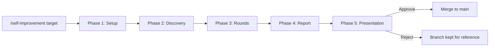
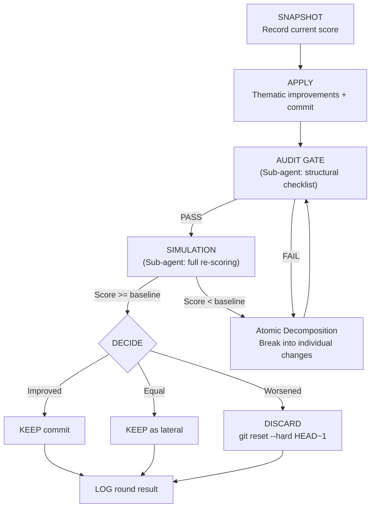
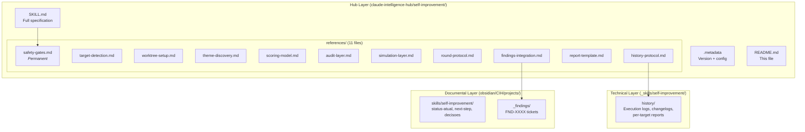

# Self-Improvement Framework

**Make your skills, scripts, projects, and protocols better — automatically, safely, and measurably.**

---

## What Is This?

The Self-Improvement Framework is an agent-agnostic engine that takes any target in your workspace — a skill, a project, a script, or a protocol — and iteratively refines it through structured rounds of analysis, modification, and testing. Think of it as a code review bot, but one that also reviews your documentation, processes, and operational protocols.

Every change happens in a disposable git worktree. Independent sub-agents evaluate the changes without knowing what was changed or why, eliminating confirmation bias. You see a before/after scorecard and decide whether to merge. Nothing touches your original files without your explicit approval.

---

## The Problem It Solves

Skills, scripts, and project documentation accumulate blind spots over time. The author who wrote them cannot easily see their own gaps — ambiguous instructions, missing edge cases, inconsistencies between sections, cross-platform assumptions that do not hold.

Manual review catches some of this, but it is slow, biased toward what you already know, and hard to do systematically across dozens of targets.

This framework automates the discovery-and-fix cycle while keeping humans in control of what actually ships. It finds the gaps, proposes specific fixes, validates them through two independent testing layers, and gives you a clear recommendation — all without touching the original until you say so.

---

## How It Works



| Phase | What Happens |
|-------|-------------|
| **Setup** | Detects target type, creates an isolated worktree, loads prior history |
| **Discovery** | Reads all target files, calculates baseline scores, identifies improvement themes by gap analysis |
| **Rounds** | Applies one theme per round, tests each through audit + simulation sub-agents, keeps or discards based on scoring |
| **Report** | Records execution history, generates a detailed report with before/after comparisons |
| **Presentation** | Shows you the results and waits for your decision. Merge, reject, or review selectively |

---

## Quick Start

**Improve a skill (default 5 rounds, auto-detected themes):**
```
/self-improvement claude-intelligence-hub/agent-orchestration-protocol
```

**Improve a script with a specific focus:**
```
/self-improvement _skills/daily-doc-information/scripts/checkpoint-verify.sh --theme error-handling
```

**Improve a project with fewer rounds:**
```
/self-improvement obsidian/CIH/projects/hr_kpis_board --rounds 3
```

---

## Example: Full Run

Suppose you run:

```
/self-improvement claude-intelligence-hub/agent-orchestration-protocol
```

Here is what happens step by step:

1. **Setup** -- The framework detects that `agent-orchestration-protocol` is a Skill (it has `SKILL.md` + `.metadata`). It creates the worktree `_worktrees/self-improvement-agent-orchestration-protocol-2026-03-28/` on branch `self-improvement/agent-orchestration-protocol-2026-03-28`.

2. **Discovery** -- All files in the skill directory are read from disk. The framework scores the target across 5 dimensions (structural integrity, instruction clarity, edge case coverage, internal consistency, cross-agent compatibility). Suppose the baseline composite comes out to 7.2 ("Good"). The two lowest-scoring dimensions — say, edge case coverage (5.8) and cross-agent compatibility (6.5) — become the first themes in the round schedule.

3. **Rounds** -- Round 1 targets edge case coverage. The framework applies improvements (adds missing error handling instructions, documents boundary conditions), commits them, then dispatches two sub-agents:
   - **Audit sub-agent** receives only the modified files and a structural checklist. It checks for broken references, missing sections, formatting issues. Verdict: PASS.
   - **Simulation sub-agent** receives the modified files, the scoring dimensions, and the baseline scores — but not what was changed or why. It re-scores everything fresh. New composite: 7.6. Verdict: PASS (improved).
   - Decision: KEEP. Round 2 begins targeting cross-agent compatibility.

4. **Report** -- After all rounds, the framework writes a detailed report: baseline 7.2, final 8.1, delta +12.5%. Each round's changes, scores, and decisions are documented.

5. **Presentation** -- You see:
   ```
   agent-orchestration-protocol refined: 7.2 -> 8.1 (+12.5%) in 5 rounds.
   Branch: self-improvement/agent-orchestration-protocol-2026-03-28
   0 findings registered (out of scope).
   Recommendation: Approve merge.

   Do you want to approve the merge?
   ```
   You review the report, say "approve", and the changes merge into main. Or you say "reject", and the branch is kept for reference without affecting anything.

---

## Target Types

| Type | Detected By | Scoring Dimensions | Example |
|------|------------|-------------------|---------|
| **Skill** | Has `SKILL.md` + `.metadata` | Structural integrity, instruction clarity, edge case coverage, internal consistency, cross-agent compatibility | `claude-intelligence-hub/repo-auditor` |
| **Script** | Single file with `.sh`, `.ps1`, `.py`, `.js`, or `.ts` extension | Clean execution, error handling, cross-platform, maintainability, integration | `_skills/daily-doc-information/scripts/checkpoint-verify.sh` |
| **Project** | Has `status-atual.md` or `PROJECT_CONTEXT.md` | Documental completeness, cross-doc consistency, traceability, status clarity, hygiene | `obsidian/CIH/projects/hr_kpis_board` |
| **Protocol** | Single `.md` file that is not a skill or project doc | Clarity, completeness, consistency, applicability | `claude-intelligence-hub/references/project-planning-methodology-guide-v1.0.md` |

---

## Scoring

Every target type has weighted dimensions that sum to 100%. Each dimension is scored from 0 to 10 by an independent sub-agent that reads the target files cold — no context about what was changed or why.

The composite score is calculated as: `sum(dimension_score * weight)`.

| Composite Score | Label |
|----------------|-------|
| 0.0 -- 3.9 | Poor |
| 4.0 -- 5.4 | Below Average |
| 5.5 -- 6.4 | Needs Work |
| 6.5 -- 7.4 | Good |
| 7.5 -- 8.4 | Very Good |
| 8.5 -- 10.0 | Excellent |

Themes are prioritized by **gap** — the dimension furthest from 10.0 gets addressed first. Dimensions already at 9.0 or above are skipped entirely. If all dimensions are at 9.0+, the framework reports "already excellent" and exits without making changes.

---

## Safety Gates

Six non-negotiable gates protect your work throughout every execution:

| # | Gate | What It Means |
|---|------|--------------|
| 1 | **Total Isolation** | All work happens in a disposable git worktree. Main is never checked out during execution. |
| 2 | **Original Untouchable** | No file outside the worktree is modified. The only exception is writing execution logs to `history/`. |
| 3 | **Merge Only With Authorization** | The framework presents its report and stops. It will never auto-merge, even if you said "run and apply" at the start. |
| 4 | **Guaranteed Rollback** | Every change is a separate atomic commit. Reject the merge and your workspace is exactly as it was before. |
| 5 | **Total Transparency** | Every modification, every discard, every decision is logged. Nothing happens silently. |
| 6 | **Scope Limited to Target** | Only files inside the declared target directory are modified. Issues found elsewhere are registered as findings for you to handle separately. |

Additionally: only one execution per target per day is permitted (Concurrent Execution Guard), and rejected merges are logged — the branch is kept for reference, findings persist regardless of approval.

---

## Round Flow

Each improvement round follows a strict 6-step protocol. The key decision point is whether changes survive two independent evaluation layers:



The audit and simulation sub-agents receive only the files — never the improvement rationale, the orchestrator's reasoning, or prior round context. This is what eliminates confirmation bias: the evaluator literally does not know what was changed, so it cannot rationalize flaws.

If a package of changes fails either gate, the framework decomposes it into individual changes and re-tests each one separately (Atomic Decomposition). Changes that still fail after two attempts are registered as findings and skipped.

---

## Architecture

The framework spans three layers of the workspace, with 11 modular reference files loaded on-demand to minimize context consumption:



References are loaded and unloaded per phase. Only `safety-gates.md` stays loaded for the entire execution. `scoring-model.md` is loaded in Phase 2 and retained through Phase 3 since every round needs the scoring dimensions.

---

## Q&A

**Can this framework modify my files without my permission?**
No. Gate 3 is absolute. The framework presents a report and stops. Merge requires your explicit command after reviewing the results. There is no auto-merge mode, even if you request one.

**What happens if I reject the merge?**
Nothing changes on main. The improvement branch is kept for reference. All findings registered during execution persist in the findings index. The execution is logged as "Rejected" in history.

**Can I run this on any file or directory?**
It must be one of the four supported types: skill, script, project, or protocol. The framework auto-detects the type based on marker files (SKILL.md, .metadata, status-atual.md, etc.) or file extension. If detection fails, it asks you to clarify.

**What if the improvements make things worse?**
Each round is independently scored. If a round's changes worsen the composite score, those changes are automatically discarded (reverted). Only improvements or lateral changes survive. The before/after delta across all rounds should always be zero or positive.

**Do I need sub-agents?**
Yes. Sub-agents are mandatory and non-negotiable. An agent evaluating its own changes in the same context has confirmation bias. The framework requires Opus 4.6 (1M context) sub-agents for both the audit and simulation layers. If your platform does not support sub-agent dispatch, the framework will not run.

**How long does an execution take?**
It depends on target size and round count. A 5-round execution on a medium-sized skill typically involves reading all files 6+ times (once per round plus baseline), dispatching 10+ sub-agents, and producing a detailed report. Budget 15-30 minutes for a full run.

**Can I force a specific improvement theme?**
Yes. Use `--theme <theme>` to prioritize a specific theme as round 1. Remaining rounds still follow gap-based ordering.

**What if all dimensions are already high?**
If every dimension scores 9.0 or above, the framework reports "already excellent" and exits without scheduling any rounds. It will not make changes for the sake of making changes.

**Can multiple agents run this simultaneously on different targets?**
Yes, as long as each targets a different path. The Concurrent Execution Guard only prevents multiple executions on the same target on the same day.

**Where do I find the results after a run?**
Execution history is stored at `_skills/self-improvement/history/<target-slug>/<YYYY-MM-DD>/`. The full report, per-dimension scores, and round-by-round log are all there. A cross-target dashboard lives at `_skills/self-improvement/history/index.md`.

---

## Dos and Don'ts

| Do | Don't |
|----|-------|
| Run on one target at a time for focused improvements | Run on your entire workspace at once |
| Review the full report before deciding to merge | Approve without reading the report |
| Use `--rounds 2-3` for a quick first pass on unfamiliar targets | Always max out at 10 rounds — diminishing returns are real |
| Use `--theme` when you know what needs work | Ignore the gap-based auto-prioritization without reason |
| Check prior execution history before running again | Run back-to-back on the same target expecting different results |
| Let the framework register out-of-scope findings as FND-XXXX | Manually expand scope mid-execution to "fix everything" |
| Trust the sub-agent scoring — it is deliberately unbiased | Override scoring because "the changes look good to me" |
| Run on scripts that are actively used in production workflows | Run on files under active development by another agent |

---

## Getting Started Checklist

Before your first run, verify these prerequisites:

- [ ] **Platform supports sub-agents.** Claude Code with `claude -p`, Codex with `codex exec`, or equivalent. The framework will check this and stop if unsupported.
- [ ] **Opus 4.6 (1M context) is available.** All sub-agent dispatches require this model. No fallback.
- [ ] **Git is clean enough.** The framework creates a worktree from your current HEAD. Uncommitted changes on main are fine (they will not enter the worktree), but a clean state is recommended.
- [ ] **Target path is valid.** Must be a relative path from `C:\ai\` to an existing directory or file.
- [ ] **No concurrent execution.** Check that no branch named `self-improvement/<target>-<today's date>` already exists.
- [ ] **`_worktrees/` directory exists.** The framework creates worktrees here. If the directory does not exist, it will be created automatically.

---

## Version History

| Version | Date | Changes |
|---------|------|---------|
| 1.0.0 | 2026-03-28 | Initial release. 5 phases, 11 modular reference files, two-layer testing (audit + simulation), sub-agent mandate, worktree isolation, weighted scoring across 4 target types, gap-based theme prioritization, atomic decomposition protocol, historical tracking with per-target changelogs. |

---

## Links

| Resource | Path |
|----------|------|
| **Full Technical Specification** | [`SKILL.md`](SKILL.md) |
| **Design Spec** | [`obsidian/CIH/projects/generalx/reports/2026-03-28-self-improvement-design-spec-v1-8d6f85a0-magneto.md`](../../obsidian/CIH/projects/generalx/reports/2026-03-28-self-improvement-design-spec-v1-8d6f85a0-magneto.md) |
| **Implementation Plan** | [`obsidian/CIH/projects/generalx/02-planning/2026-03-28-self-improvement-implementation-plan.md`](../../obsidian/CIH/projects/generalx/02-planning/2026-03-28-self-improvement-implementation-plan.md) |
| **Safety Gates Reference** | [`references/safety-gates.md`](references/safety-gates.md) |
| **Scoring Model Reference** | [`references/scoring-model.md`](references/scoring-model.md) |
| **Execution History** | [`_skills/self-improvement/history/`](../../_skills/self-improvement/history/) |
